# 시암파크시티 물놀이장

태국의 캐리비안베이인 시암파크시티로 갔다.

예약은 태국 출발전 몽키트래블 사이트를 통해 예약했다.

특이하게 여기는 점심 부페 식사권까지 포함되더군.

예약전 후기를 읽어보면, 좀 많이 낙후되어 있어 그리 큰 기대는 하지 말라는 것이 많았다.

물놀이 하나만 하면 되지 하며 별 기대없이 출발했다.

거리는 제법 멀어, 숙소에서 우버를 타고 50분 가량 갔다.

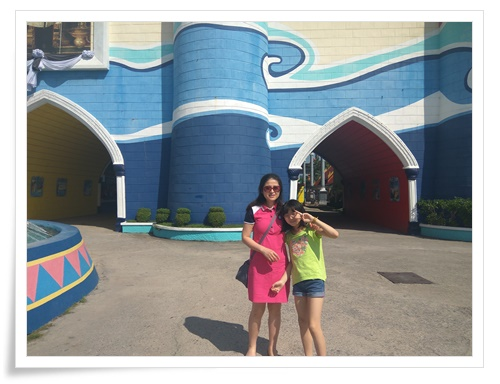

\- 입구 도착

\- 바우처를 입장권과 교환하기 위해 티켓부스로 가는 중.

아무리 평일 오전이라고 하지만 사람이 너무 없다.

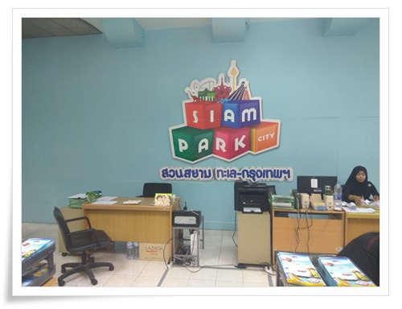

\- 이곳 티켓부스 티켓 교환

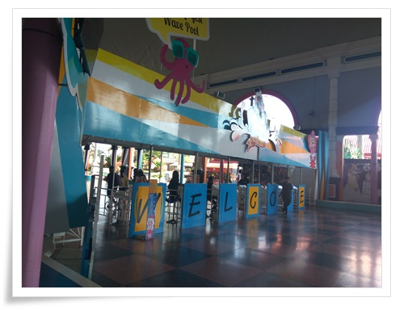

\- 그리고 입장.

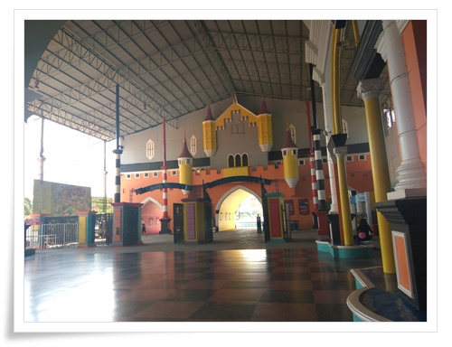

\- 한산하다

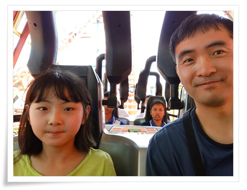

\- 여기는 특이하게 놀이공원과 물놀이장이 같이 있다.

놀이기구는 그리 많지는 않고 한 서울랜드 2/3정도 수준.

대기시간 제로이기에 먼저 롤러코스터부터 탔다.

탑승객은 나와 딸내미 그리고 다른 커플 이렇게 4명이 전부.

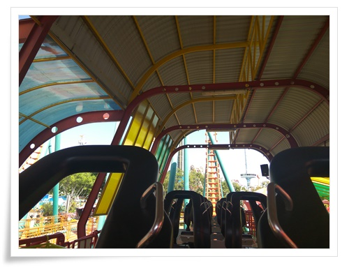

\- 이렇게 텅빈 롤러코스터는 처음 타보는 것 같다.

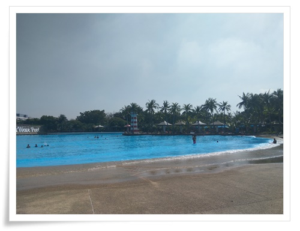

\- 본격적인 물놀이 시작.

아시아에서 가장 큰 인공파도풀이라고 한다.

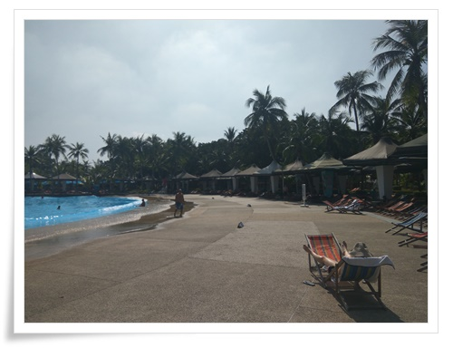

\- 역시 평일이라 한산했다.

우리나라에서 항상 사람으로 가득찬 물놀이장만 보다가 이렇게 한산한 곳을 오니 좋더군.

인공비치라 모래가 없어 옷과 발바닥에 모래 안 묻는 것도 좋았다.

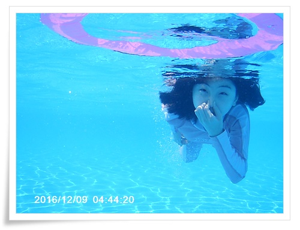

\- 딸내미도 아주 재밌어한다.

\- 물놀이 하다 지치면 이렇게 비치체어에 앉아 휴식.

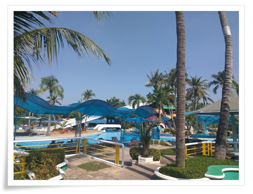

\- 인공파도풀장만 있는 것이 아니라 다른 물놀이 기구도 있다.

여기서도 대기시간이 없어 원없이 탔다.

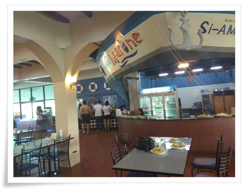

\- 점심은 입장권에 포함된 부페 식사권으로 점심 부페.

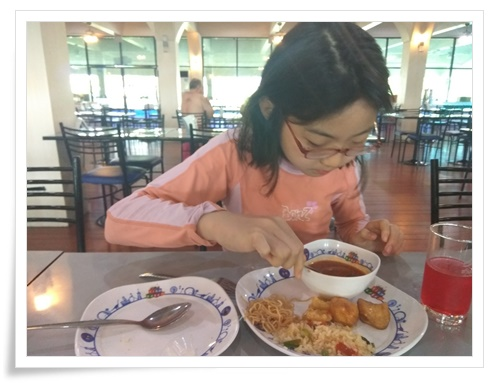

\- 음심은 서양식과 태국음식 이렇게 되어 있다.

뭐 그리 맛있다고 보기는 어렵지만, 그렇다고 못 먹을 정도는 아니었다.

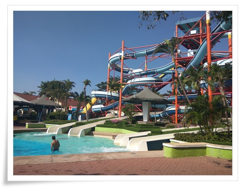

\- 딸내미와 한 10번 넘게 탄 슬라이드

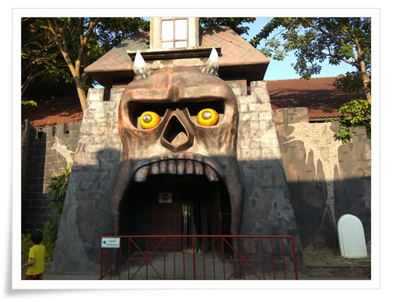

\- 이게 태국 귀신의 집.  후기에 여긴 제법 무섭다고 하는데 딸내미가 들어가기 싫다고 하여 들어보지는 못했다.

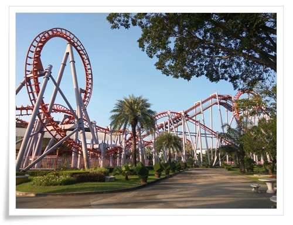

\- 물놀이 마치고 탄 또 다른 롤러코스터.

이것도 손님이 없어 나와 딸내미 둘이서만 탔다.

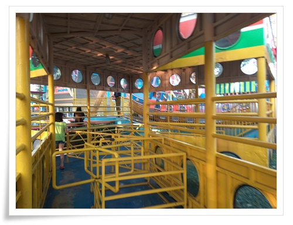

\- 역시 나와 딸내미의 전용 바이킹.

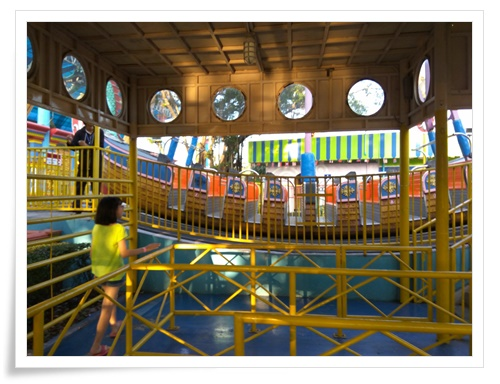

\- 바이킹을 탔는데, 이제 나도 늙었는지 어지러웠다.

더이상 바이킹을 탈 수 있는 나이는 지났나 보다.

타고 나니 속도 미식미식거리더군.

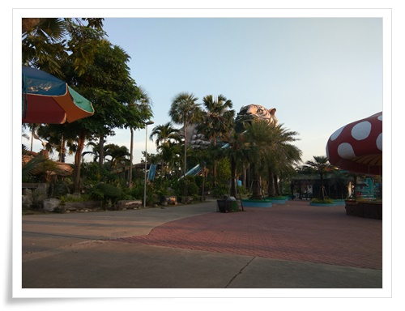

\- 저 앞의 후룸라이드도 역시 대기시간없이 탔고.

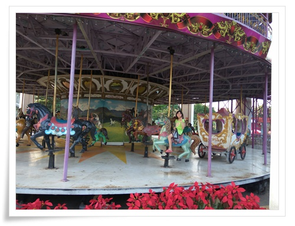

\- 회전 목마도 대기시간은 커녕 전세를 내다시피하여 탔다.

시설이 낡긴 했으니, 여기 시암파크시티 만족스러웠다.

우리나라라면 줄 서는 것으로 시간을 다 보냈을 것을 온전히 즐기는데 다 쓸 수 있었으니 말이다.

