# 비오는 축령산 자연휴양림으로 캠핑

나에게 있어 캠핑의 즐거움은, 아늑한 텐트안 이불 속에서 이른 아침 텐트위로 우두둑 떨어지는 빗소리를 들으며 깨는 것.

그리고, 그 빗소리를 음악삼아 한껏 이불속 게으름을 피우는 것.

자주 가다가, 딸래미 태어나고서 한동안 못 갔다.

그동안 캠핑붐이 불었더군.

주5일제 시작되고서도 캠핑붐은 별로 없었는데, 아마 kbs 1박2일 프로그램이 인기를 끌면서 붐이 불지 않았나 생각된다.

캠핑붐이 그다지 반갑지는 않다.  너무 장비로 승부하는 사람들이 많아져 상대적 빈곤감을 느끼게 되서 그런게 아닌 가 싶기도 하고,..

경기도권 자연휴양림 홈페이지에도 토요일에는 야영데크 자리가 없으니, 야영할 사람은 미리 전화로 야영데크 자리 있는지 확인하고 출발하라는 공지사항이 떠 있더군.

요즘 철에는 보통 금요일오후에 야영데크는 만석이 된다고 한다.

일단 날짜는 일요일로 정했다.

토요일은 비가 와서 자리는 있겠지만, 비가 오는 동안 텐트 치기는 녹록치가 않으므로.

어디로 갈까 하다가, 축령산자연휴양림으로 정했다.

축령산 야영장이 가장 만족스러웠다.

일단 거리도 가까운 편이고,

위치도 제법 깊숙히 있어, 차소리도 안 들리고,

잣나무 숲이 울창하여 그늘도 많고,

오토캠핑장이 아니어서, 비싼 장비로 무장한 사람도 별로 없고

숯불을 펼 수 없어, 숲 자체를 즐길 수 있다.

짐을 챙기고, 출발했다.

SUV, RV차 있을 때에는 짐에 대해서 큰 생각이 없었는데, 승용차다 보니 짐을 줄이는데 좀 신경을 썼다.

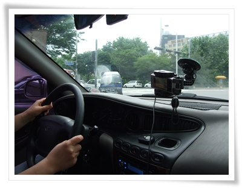

\- 운전은 면허 딴지 2달된 아내가 했다.  몇번 스릴 있는 순간이 있었다.

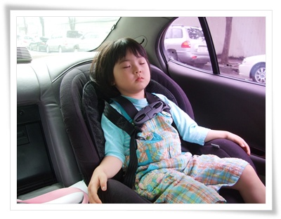

\- 뒷좌석에서 근엄한 사장포즈로 눈을 감고 있는 딸래미.

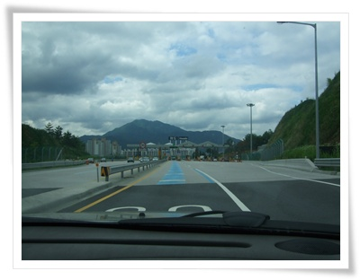

\- 서울, 춘천간 고속도로를 타고 화도 IC에서 나왔다.

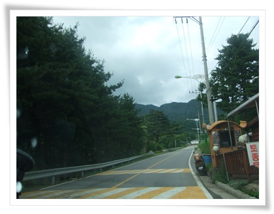

\- 수동면.  이제 휴양림 3km 전.

휴양림 입장료 총 9,000원.

성인한명씩 천원해서 총 2천원, 주차료 3천원, 아영데크사용료 4,000원

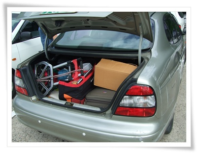

\- 트렁크에 실린 짐.

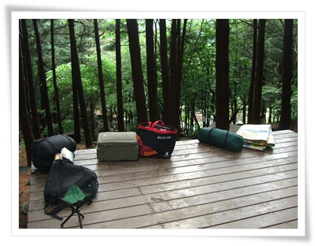

\- 짐을 다 꺼냈는데, 별로 안 되는군.  역시 캠핑은 가벼운 게 좋지.

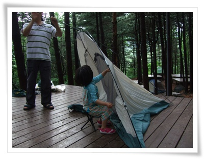

\- 아비는 서서 텐트치는데, 딸래미는 감히 의자에 앉아서 치는군.

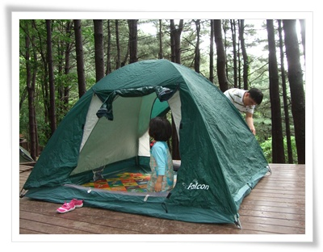

\- 장판을 까니까, 바로 텐트안으로 들어가 자리를 잡는군.

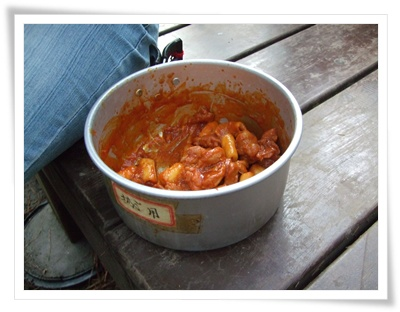

\- 간식은 즉석 떡볶기.  산에서 먹으니 맛있군.

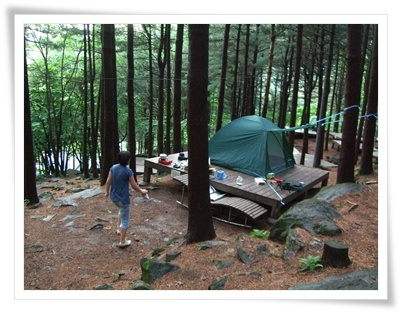

\- 일요일 오후로 사람들이 다 빠져나가고 별로 없다.  8년전에 3만5천원주고 산 텐트다.

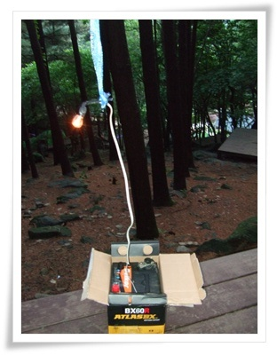

\- [전에 교체하고 남은 자동차 배터리](../10482752.html) 를 랜턴으로 재활용.  전구는 브레이크등.

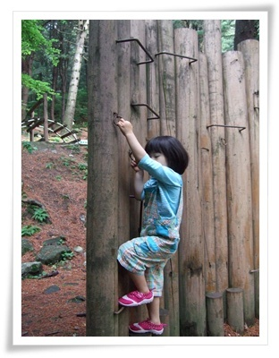

\- 딸래미 데리고, 숲속 놀이터 한번 순회해주고.

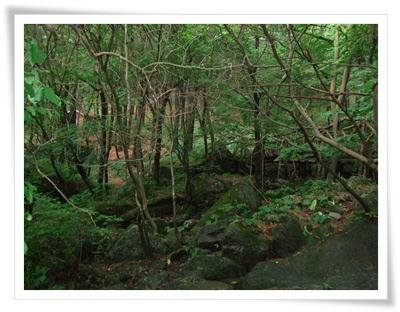

\- 서울과 가까운 경기도의 산인데도 정말 푸르다.

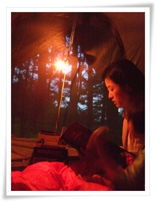

\- 술도 안먹는 부부라서 해 떨어지면 일찍 잔다.  텐트안에서 아내는 딸래미에게 책 읽어주고 있다.

출발할때 일기예보를 확인하고 갔었다.

토요일 비, 일요일 오전 비 개고, 그 다음부터 화요일까지 그냥 흐림이라고 되어 있었다.

새벽부터 비가 보슬보슬오더니, 아침이 되자, 많은 비가 왔다.

거의 폭우수준이었다.

바로 이게 캠핑의 참 재미다.

텐트에 누워, 빗소리를 듣고, 비내리는 숲 풍경을 바라보면서 한창 게으름을 피울 수 있는 점.

그러면서 피톤치드는 듬뿍 흡수하고.

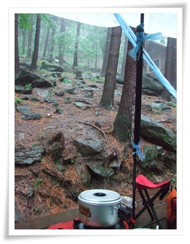

\- 많은 비가 다 좋은데, 밥 먹는게 좀 불편해, 큰 비닐로 작업 공간을 더 확보했다.

아침식사는 3분카레.

비는 11시까지 내렸다.

그 덕엔 잘 안들리던, 계곡물 소리도 콸콸 들렸다.

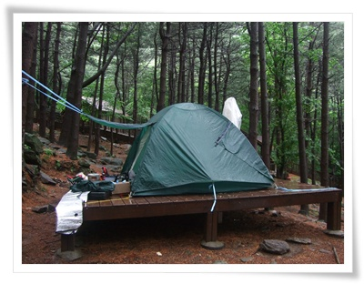

\- 폭우를 버텨낸 내 텐트.

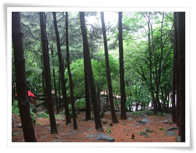

\- 화요일이 되니, 그나마 있던 사람들도 거의 다 없어졌다.

\- 점심은 컵라면으로..

원래 내 캠핑 스타일이기도 하지만, 식사는 최대한 간단히 했다.

산에 가면, 무엇을 먹어도 다 맛있기 때문에, 간편한게 장땡이다.

이번 캠핑에 먹은 것은,

저녁 육게장(마트에서 파는 인스턴트)

아침 카레(역시 인스턴트 3분카레)

점심 컵라면.

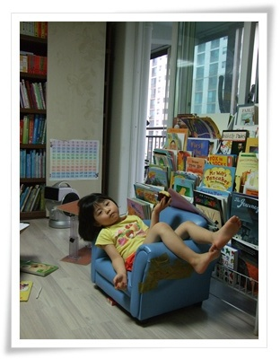

\- 편하게 실컷 놀고 와놓고선, 혼자 피곤한 척하는 딸래미.

