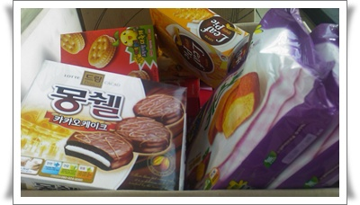
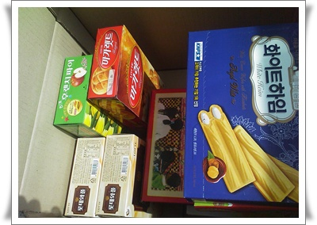

# 회사의 소소한 복지

식구보다도 더 많은 시간을 보내는 공간인 회사.

그래서 회사에서 보내는 시간이 즐거운 것은 불가능할 꺼고, 가급적 덜 괴로웠으면하는 바람이 있었다.

사회생활 초반이었던 9년전 회사에서, 전직원대상 사장 면담이 있었다.

내 차례가 왔을 때 내가 건의했던 것은 싸구려 커피와 녹차만 갖다놓지 말고, 다른 차들도 비치했으면 좋겠다고 했었다.

알았다고 해놓고선 딱 한달 그렇게 하고, 사람들이 비싼 차만 먹는다고 예전으로 돌아갔던 때가 생각이 난다.

차가 비싸봤자, 얼마나 더 들어간다가 쪼잔하게,..

사람이란게 큰 것보다는 작은 것, 사소한 것에 감동을 하는 법인데,..

그러고 보면 10년전 회사가 그런 사소한 자랑거리 만드는 이벤트를 잘했다.

연봉은 작고, 일체의 수당도 없고, 퇴직금마저 연봉에 포함시키는 꽤 안 좋은 쪽으로 머리를 썼었는데, 1억페이지뷰 돌파했다고 괌으로 전직원 놀러보내주거나, 회사 지하실에 헬스장을 설치하고 신문에 기사나오고 한 것을 보면..

잘나가는 회사들이랑 비교는 불가하지만 동종,비슷한 규모의 다른 회사들과 비교했을 때 현재 우리 회사의 장점이라면 뭘까?

내 생각하기엔 소소한 복지.

1\. 칼퇴근 : SW개발을 하는 회사치고 이만큼 칼퇴근이 보장되는 회사도 없을 듯..

                야간에는 사장님이 사무실을 지킨다.

2\. 간식무한리필 : 어찌보면 비만과 영양 불균형에 이르게 하는 건강에는 안좋겠지만,

                암튼 베란다에 과자들이 쌓여 있고, 희망하는 과자들이 리필된다.

3\. 매주 금요일 점심은 회사 비용 :  그래서 자기 돈 주고는 좀 먹기 아까운 파스타집 같은 곳을 주로 가곤 한다.

4\. 문화생활비와 매일 배달되는 요구르트같은 음료수 지원 : 매달 10만원 한도

5\. 팀회식비 : 한팀 평균구성원 4명.  매달 30만원까지 지원되니,, 제법 맛집으로 찾아다니는 듯 하다.

\- 베란다의 과자박스에 놓인 과자들.

