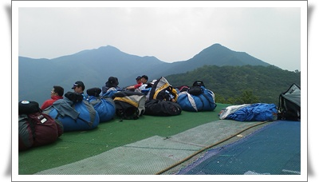
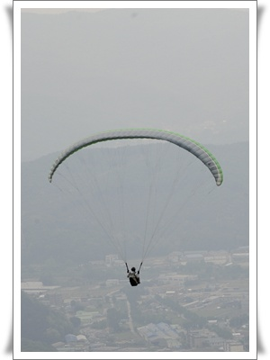

# 패러글라이딩 3일차 - 3,4,5회 비행

[패러글라이딩 2일차](../10493661.html) 에서는 첫비행을 했었다.

5월 29일 토요일 제시간에 도착했다.

지상훈련없이 바로 이륙장으로 올라갔는데, 바람이 거꾸로 분다.

이곳은 착륙장이 이륙장 서쪽에 있어서,  고수아니면 서풍에서만 이륙을 한다.

패러글라이딩도 어지간히 기상에 민감하다.

\- 보따리도 풀지 못하고, 그냥 바람방향 바뀌기만 기다리는 사람들

오전을 이륙장에서 대기만 하다가, 결국 점심먹으로 차 타고 내려왔다.

오후 바람이 서풍으로 바뀌었다고 하여, 다시 정상으로 올라갔다.

\- 서풍이긴 한데, 바람이 약하다.  저게 빵빵해야 좋은 바람이라고 한다.

바람이 약하면, 이륙실패가 많다고 한다.

양력이 충분해야 하는데, 그러기 위해 전방이륙으로 빨리 뛰어야 한다.

\- 이륙실패로 밑으로 추락한 분을 구하러 내려가는 사람들.

\- 내 차례가 되었다.  밑으로 열심히 뛰는거다.

\- 바람이 부족해, 전과는 달리 산 밑으로 푹 떨어졌다가, 떨어지는 속도로 다시 올라왔다.

\- 활공하는 중.

총 세번 비행했다.

3회차.

지난주와는 달리 이륙하는게 좀 겁나긴 했다.

열심히 뛴다고 했는데, 이륙시 날개가 접혔다고 한다.  팔을 쭉 뻗지 않고 구부린게 원인이었다고 한다.

착륙은 제대로 했다.

4회차.

이륙시 양력부족으로 밑으로 푹 꺼지는 느낌이 있었다.

착륙시 방향 조종을 너무 자주했다는 지적이 있었다.

5회차.

이륙시 A라이저 놓는 시점이 일렀다.

그래서 공중에 떴다가 다시 내려왔다.

다행히 발이 땅에 닿자마다 열심히 더 뛰어 이륙은 무사히 했다.

착륙도 괜찮았다.

패러글라이딩하는 분들이 대부분 40대중반의 좀 부유한 듯 하다.

이유는 장비(기체, 하네스, 헬멧, 무전기, 비행화, 고도계 등)를 제대로 갖추는데, 그에 들어가는 비용이 천만원정도가 된단다.

그리고 성격들은 다들 괜찮아보인다.

아무래도 술이나 다른 여흥과는 거리가 먼 스포츠라서 그런 것 같다.

