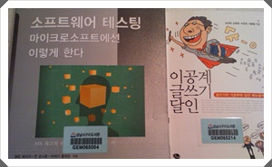

# 구미도서관 희망도서 도착

구미도서관에 희망도서로 신청한 것이 구입됐다는 문자메시지가 왔다.

희망도서로 신청한 것중 "소프트웨어 테스트 마이크로소프트에선 이렇게 한다"라는 책과 "이공계 글쓰기 달인"이라는 책 두권이 구입됐다.

이럴 때 세금 내는 것에 만족감을 느낀다.

아무래도 내게 직접적으로 와 닿아서일꺼다.

신청 배경은 마이크로소프트웨어 잡지의 신간책 소개글을 보고 재미있겠다 싶어 했다.

일단 가벼운 것 "이곳계 글쓰기 달인"이라는 다소 자극적인 제목의 책을 읽었다.

내용이 그리 길지는 않아, 세시간 읽으니 끝나더군.

그리 뭐가 남지는 않는다.  걍 "이공계가 글쓰기를 못하는데, 아무리 내용이 좋아도 포장을 잘 해야 한다"라는 당위성을 좀 재미있게 설명한 정도라 할까..

"소프트웨어 테스트 마이크로소프트에선 이렇게 한다"

우리 회사에 공식적인 QA조직은 없다.  그러다보니 테스팅이 좀 취약하긴 하다.

테스팅 관련 서적도 별로 없고, microsoft는 어떻게 하나 궁금하기도 했다.

두께도 두껍고, 내용도 좀 어렵더군.  이제 책 반정도 읽었는데, 이해안하가는 부분도 많다.

2번은 읽어야겠다.

