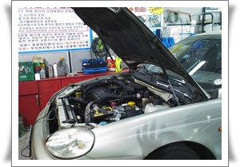
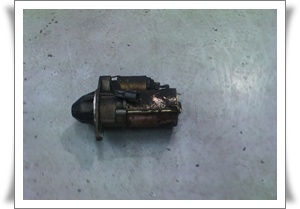

# 레간자 스타트모터 교체

지난 주말 패러글라이딩을 타려고 차에 시동을 거는데 안 걸렸다.

"딸깍" 소리만 나고, 스타트모터 돌아가는 소리가 안 들렸다.

예전 갤로퍼가 이랬었다.

그래서 갤로퍼 타고 다닐 때는 긴 우산을 차에 싣고 다니며 시동 안 걸릴 때마다 스타트모터를 때려 시동이 걸리도록 했었다.

원인은 스타트모터의 회전축 즉 마그네틱부분이 카본찌꺼기가 끼어 접촉불량을 일으키는 것이 문제이다.

임시 해결책은 갤로퍼와 마찬가지로 스타트모터에 충격을 주는 것이라, 본넷을 열었는데 어느게 스타트모터인지 모르겠더군.

그래서 대충 벨트에 연결되어 있는 것을 때려봤는데, 안 걸리더군.

결국 긴급출동서비스를 불렀다.

목적지는 정자동 10년정비센터로 갔다.

도착하니, 기다란 쇠봉으로 스타트모터를 때리더군.  그러니 걸렸다.

내가 스타트모터의 위치를 완전히 잘 못 싶었더군.

스타트모터가 엔진 뒤 밑쪽에 있는 거라 잘 안보이는 곳에 있었다.

스타트모터가 맛이 갔으니, 교체해야한다고 했다.

이미 카센터까지 끌고 온 상태라 그냥 갈 수도 없고, 교체하기로 했다.

재생품으로 하여 11만원이라고 했다.

\- 스타트모터 교체를 위해 리프트에 올려진 차

\- 탈거된 스타트모터

비용은 현금으로 10만원을 지불했다.

정비하는 모습을 보니 꽤 어려워 보이더군.

리프트로 띄워놓고 차 밑에서 작업하는데, 꽤 힘을 많이 쓰더군.

원래 10년정비센터는 부품가와 공임료를 따로 한다고 하던데, 이곳은 그렇지 않더군.

인터넷으로 부품가를 알아봤다.

[신품가격은 112,310원](http://www.smpart.co.kr/)

[재생품의 가격은 55,000원](http://reborncar.com/index.php?modea=pd_view&id_no=6193&hc_id=DW005&types=2)

재생품으로 했으니, 공임이 4만 5천원인 셈이로군.

적당한 가격이다.

