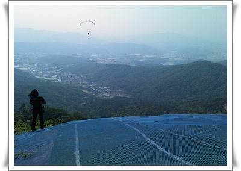
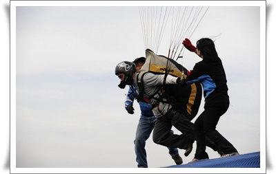
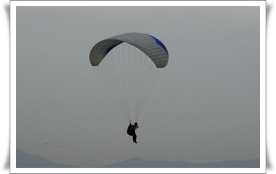

# 패러글라이딩 2일차.  1,2차 비행

5월 21일.  연휴 첫날이라, 차가 무지 많았다.

그래서 도착한 시각이 12시 반.

[지난 1일차](../10487898.html) 에는 지상훈련과 탠덤비행을 했다.

이번엔 사무실옆에서 비행 시뮬레이션 연습을 하고 나서, 고도 460미터의 활공장으로 올라갔다.

\- 착륙장.  여기서 날아올라 저 아래로 착륙한다.

-첫 비행

1차 비행.

이륙은 활공장에서 몇발자국 뛰다보니 어느 순간 공중에 떠 있었다.

무전기로 지상의 지시를 받으며 글라이더 조종.

생각보다 짜릿하지는 않았다.

아마도 바람과 같이 움직이는 거라, 속도감이 별로 없고, 의자가 너무 안락하여 안정감을 주기 때문인 듯 하다.

착륙할 때는 좀 스릴있었다.

착륙준비를 하고, 몸을 하네스에서 빼는데 잡고 있는 조종줄의 세기를 일정하게 유지하지 못해 2미터정도 급하강했다.

2차 비행.

착륙장의 바람의 반대방향으로 불어, 착륙을 반대로 했다.

바람의 방향이 일정치 않아, 착륙할 때 기체가 많이 흔들렸다.

고도처리에 익숙치 못해 전기줄에 걸릴 뻔 했다.

하강 속도가 너무 빨라, 몸을 빼지 못하고 하네스로 착륙했다.

오늘의 추가 비용.

일비 2만원,  정심값 5천원,  비행 1,2차 각 5천원씩해서 3만5천원.

