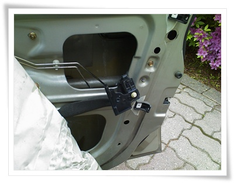
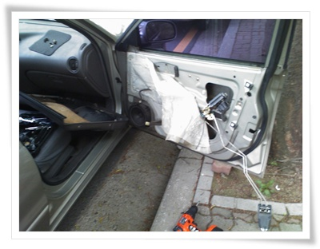
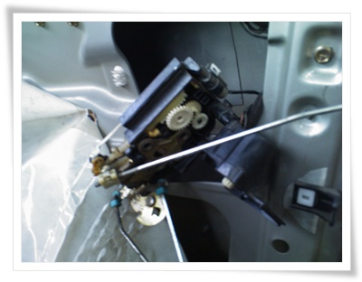

# 자동차 도어락이 자동으로 안되는 것 직접 고치다

이제 레간자의 마지막 정비.

조수석 문이 자동으로 안 잠기는 문제가 있었다.

즉, 운전석 문이 잠기거나 열리면, 자동으로 따라 동작해야 하는데, 조수석 문만 동작을 안하는 거였다.

인터넷을 열심히 뒤져봤다.

운전석 동작 신호에 따라, 다른 문들이 열리고 닫히는 것은 각 문마다 도어 래치하는 부품이 동작하는 것인데, 그 도어 래치에 들어가는 도어모터부터 점검을 해 보라는 거였다.

그래서 또 용감히 문짝을 뜯었다.

\- 분해한 문짝과, 그 안에서 꺼낸 도어 모터

이번 건은 꽤 난해했다.

문짝 안의 어두컴컴한 부분에 있는 부품이고, 분해하는 방법에 관한 자료도 찾을 수가 없어, 혼자서 열심히 시행착오로 하는 수 밖에 없었다.

저거 꺼낸 것도, 그냥 손으로 더듬다보니, 뭔가 걸리는 것이 있어 꺼냈더니 저거였다.  원래 딱 붙어 있어야 하는 것인데, 떨어져 있는 거였다.

먼저 도어모터 점검을 했다.  운전석 열고, 잠글 때 같이 돌더군.

일단 도어 모터는 이상 무.

원인은 저 도어모터부가 고정못하고 떨어진 것이므로, 제대로 붙이는 되는 거였다.

원래는 도어래치가 하나의 세트로 되어 있는 건데, 저게 쪼개진 거였다.

도어래치 부품가격이 3만원이므로, 카센터가면 공임 3만원정도 해서, 대략 6~7만원은 나올 것 같았다.

헝그리 정신으로 본드로 붙이기로 했다.

\- 문틈에 있는 고정볼트 세개를 풀어, 도어래치를 통채로 분해했다.

분해하는 것은 꽤 까다로왔다.  도어래치가 철심 4개랑 연결되어 있는데, 이게 어두컴컴한 틈새에 있는 것은 손을 안에다 집어넣고 쪼물딱쪼물딱하면서 해야 하는 거였다.

\- 도어래치

록타이트 801 순간접착제로 듬뿍 발라 붙힌 후, 조립은 분해의 역순에 따라 조립.

이로써 수리비 6만원 절약.

