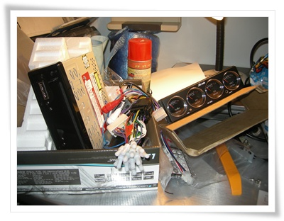
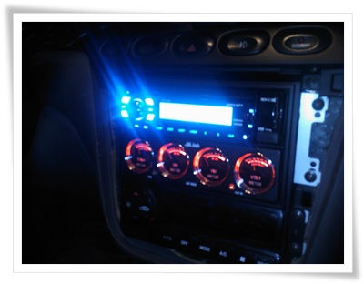
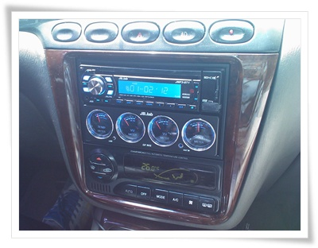

# MP3되는 카오디오 JMP3-GT1 으로 교체

내가 차에는 돈 들이지 말자라는 주의다.

자동차는 장난감.  장난감에 옵션 자꾸 추가하면 장난감 본연의 목적에 위배된다.  고로 돈을 쓰지 말자이다.

그런 중고차에 돈을 들이면 안되는데, 아내가 자꾸 CD 플레이어 되게 해달라고 졸라댔다.

CD가 자꾸 튀는 문제가 있어, 그냥 렌즈에 먼지가 꼈지지 예상하며, 레간자에 장착된 CD체인저를 분해해봤다.

먼지도 없었고, 잘 딲아봐도 현상은 똑같아,  렌즈픽업부가 고장난 듯 했다.

에누리에서 카오디오를 검색해 봤다.

jb.lab의 jmp3-gt1이란 카오디오가 원하는 기능을 갖춘 것 중에서 가격이 제일 싸더군.

기능은 라디오,CD,SD카드,USB메모리, AUX,리모콘.  즉 카세트테잎빼고는 다 되더군.

전용마감재를  4천원에 추가구매해서 93,000원주고 샀다.

\- 택배 온 것을 일단 풀어봤는데, 전선 뭉치가 기를 꺾게 하더군.  괜한 짓을 한게 아닌가 하는..

구성품에 같은 온 것이 멀티미터.

원래 카오디오가 2단짜리인데, 이것은 1단짜리가 1단이 비게 되는데, 그것을 이 멀티미터로 채우라는 것이다.

온도계,전압계,좌우 음량을 나타내주는 것인데, 양카에나 다는 것이라 별로 내키지는 않지만, 그렇다고 빈칸을 그대로 두기도 보기 안좋아 집어넣기로 했다.

퇴근후 밤에 작업을 시작했다.

먼저 기존 카오디오 뜯어 내기.

이건 판넬 힘으로 뜯고, 나사 4개 풀으니 분리되더군.

다음 새 카오디오 집어넣기.

이게 좀 많은 노력을 기울여야 했다.

차마다 규격이 다 다른데, 새 카오디오는 대부분에 맞게끔 한 거라, 그 간극은 설치하는 사람이 알아서 맞춰야 했다.

얼마나 깔끔하게 잘 맞추느냐가 기술의 차이를 보여주는 거라 보면 된다.

전선뭉치도 많다 보니, 끼어넣는 것도 쉽지 않더군.

전선뭉치가 안 깔리게 잘 되도록 잘 해야 했다.

\- 밤에 장착후, 테스트.  양아치 차에서 많이 보던 싸구리 불빛 색감이라 좀 그렇군.

기능 테스트후, 후 판넬을 씌워 마감하려는데, 판넬이 안 들어가더군.

간격이 안 맞는 거였다.  원인은 제품에 들어있는 브라켓이 레간자와 3mm 정도 오차가 있는 거였다.

구입할 때 차종도 기입하라길래 차종까지 다 기입했는데, 제대로 맞지도 않는 것을 보내주다니..

브라켓을 이리구부리고 저리 구멍 넓히고 어찌저찌하여 결국 성공했다.

성공하기 까지 10차례 넘게 들어냈다, 집어넣다를 반복하는 삽질을 했다.

\- 대낮에 다시 한번 봤다.  내 솜씨라고는 믿기 힘들게 깔끔하게 잘 했군. ㅎㅎ

헌더 대낮에 봐도 멀티미터는 확 깨는군.

바꾸고 나니 매우 만족스럽다.

기존 카오디오가 너무 낡아 소리가 잡음이 심한 상태여서 더욱 비교되어서 그렇겠지만,

라디오 음질도 좋고, cd음질도 좋고, 무엇보다 SD카드가 되니 더이상 카팩으로 지저분한 선을 길게 하지 않아도 되니 좋다.

이로써 카오디오 장착 공임 4만원 절약.

