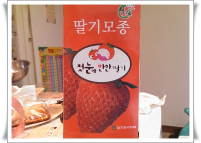
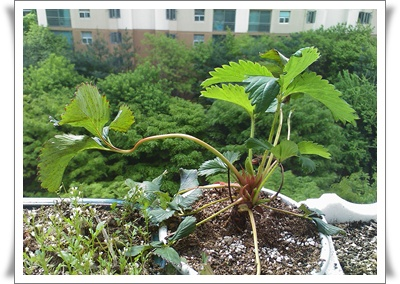

# 딸기 농사 실패

\- 홈플러스에서 거금 5천원을 주고 구입한 딸기 모종

딸기나 한번 심어볼까 해서 4월초에 사서 화분에 심었다.

4월초가 날씨가 어떠했나 하면, 봄이 없어지고 바로 여름이 왔다고 뉴스에서 떠들던 그 시기였다.

날씨도 덥고 괜찮겠다 해서 화분에 심고 베란에 내 놓았는데,

바로 이상 기온을 찾아왔다.

겨울이 다시 찾아왔다고 화면서, 일부 지역 눈이 내리기도 하면서, 무지 추운 날들이 지속되었다.

\- 베란다에 놓은 딸기 모종

꽃이 핀 줄기는 한파에 시들고, 잎사귀가 축 쳐지고, 영 상태가 아니군.

이번에 딸기 키워보고, 잘 크면 딸기 직접 키워 먹을 수도 있겠구나 혼자 즐거운 상상을 했었는데,..

