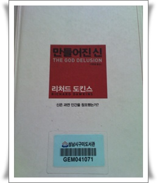

# \"만들어진 신\"을 읽고 기억에 남는 것들

무신론자들의 바이블이라고 불리는 리차드 도킨스의 "만들어진 신"을 이제야 읽어봤다.  원제목은 "THE GOD DELUSION"이니까 "망상속의 신"이 더 맞는 번역이 아닌가 싶다.

"이기적인 유전자"와 "눈먼 시계공"도 꽤 흥미있게 읽었는데, 이 책도 그 두께에 비해 상당히 재미있게 읽었다.

어려운 내용을 어떻게 이렇게 일반인도 잘 이해할 수 있게 잘 쓰는지 감탄스럽다.

책을 보면서 알게된 놀러웠던 사실들.

1\. 미국에서 무신론자의 지위가 형편없다는 것

"1999년 미국인들을 대상으로 후바자가 한 가지 사실-여성,가톨릭신자, 유대인 등등-만 제외하면 나무랄 게 없을 때 그에게 표를 주겠느냐는 여론 조사를 실시했을 때, 여성(95%), 가톨릭 신자(94%), 유대인(92%), 흑인(92%), 몰몬교도(79%), 동성애자(79%), 무신론자(49%)의 순으로 표를 주겠다는 응답이 나왔다."

2\. 왜 기독교가 세계 제 1위의 종교가 되었는가에 대한 저자의 분석

이건 이기적인 유전자에 나온 밈의 연장선으로 보이는데,

"대단히 호전적인 '전쟁의 신'을 섬기는 부족은 평화와 조화를 역설하는 신을 섬기는 경재 부족이나 신을 섬기지 않는 다른 부족과 전쟁하면 승리한다.  순교하면 곧장 낙원으로 간다고 굳게 믿는 전사들은 용감하게 싸우며, 기꺼이 목숨을 바친다. 따라서 이런 유형의 종교를 지난 부족은 부족 간의 전쟁에서 살남고, 정복한 부족의 가축을 약탈하고, 그 부족의 여성들을 첩으로 삼을 가능성이 더 높다."

라고 설명하더군.

3\. 히틀러도 독실한 기독교인.  이건 당연한 건가?

"유대인에게 맞서 자신을 지킴으로써 나는 주님을 위해 싸우고 있는 것이다." 라고 <나의 투쟁>에서 썼고, 평생에 걸치 비슷한 말을 되풀이했다고 한다.

4\. 낙태 반대를 하는 곳에서 많은 인용하는 아래 이야기가 완전히 창적된 사실이라는 점.

_아버지가 매독에 걸려있고 어머니는 결핵에 걸려있다._

_이들은 이미 자식을 넷이나 낳았는데 첫째는 맹인이고, 둘째는 사산했고, 셋째는 농아이고, 넷째는 결핵에 걸려있다._

_하지만 또 다시 어머니는 임신 중이다.__이럴 때 당신은 어떻게 하겠느냐?_

_상당수 사람들은 임신중절을 시킬 것을 권할 것이다._

_하지만 임신중절을 권한 당신은 베토벤을 살해한 것이다._

인터넷에서 떠 도는 이야기인데, 역시 모든 이야기는 출처를 잘 확인해야 하는군.

베토벤은 둘째였고, 그의 부모가 매독에 걸리지도 않았고, 유아때 죽은 첫째는 맹인도, 농아도 정신지체아도 없었다는군

5\. 종교인이 더 죽음을 두려워하는 것

나이가 들수록 종교에 귀하는 경향이 높은데, 이를 "막판 벼락치기"라고 하고, "노인 운영시설의 간호사가 지켜본 결과 죽음을 가장 두려워하는 사람들이 종교인들이라는 것을 알았다".

