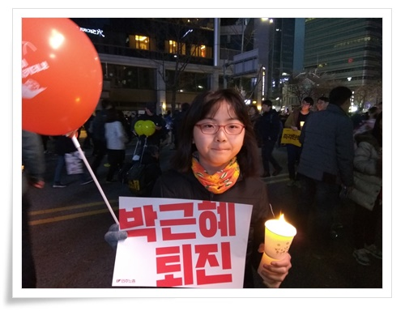
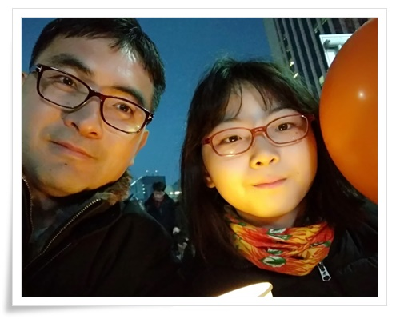

# 12월3일 딸과 함께 광화문

딸을 데리고 광화문을 갔다.

나중 딸이 더 컸을 때 때 그 순간과 장소에 자신도 있었다는 것을 기억하게 하고 싶었다.

광화문으로 바로 가는 9401을 탔다.

지난 번 전철로 갔을 때는 쭉 서서 가는 게 힘들어, 좀 막히더라도 버스가 낫겠다 싶었다.

평소 주말에서 상당히 여유 있는 버스 임에도, 탄 지 두 정거장만에 좌석은 다 찼고, 대여섯 정거장 후에는 출근길 만원 버스 정도로 입석도 더 탈 수 없을 정도로 가득찼다.

창 밖으로 본 버스정류장에는 추위에 대비한 두툼한 옷을 입고 버스를 기다리는 사람들의 줄이 길이 전율케 했다.

버스는 남산터널을 통과한 백병원에서 더 가지 못하고 우회한다고 하여 내렸다.

박근혜의 국민 김빼기용 3차 담화도 하였고, 12월2일 탄핵도 무산되어, 탄핵이 아예 물건너 간 것 같아, 사람이 그리 많지 않을 것이라 예상했는데, 아주 많았다.  나중 뉴스를 보니 역대 최대인원이라고 하더군.

