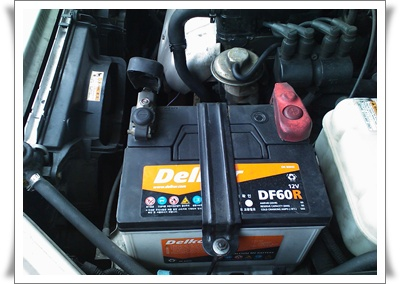
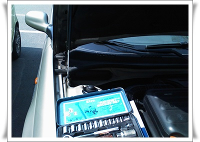
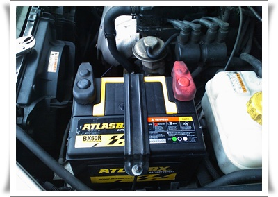

# 자동차 배터리 교체

중고차를 사면 기본적으로 정비비용으로 100만원은 들여야 한다.

내 첫차 록스타는 차값보다도 많이 들긴 했다.

엔진 헤드를 세번이나 갈았으니까..

갤로퍼때도 한 100만원 정도 들었고,

카니발은 별로 안 들었었군.  알터레이터 18만원, 배터리 10만원, 타이어2짝 16만원, 오일류교환 도합 50만원정도 든 것 같군.

레간자를 사고 10년정비센터에서 기본 정비를 받았을 때, 배터리는 올 겨울때쯤 갈면 된다고 하였다.

차량용 전압계가 있는데, 이게 10볼트 이하로 떨어져 좀 불안했다.

본넷열고 직접 전압을 재보면, 14.4볼트로 정상이어서 그냥 시거잭쪽으로 전류가 적게 공급되나 보고 했다.

그러다, 지난번 키박스 교체하는동안 전조등을 두시간 연속으로 켜놨더니, 배터리가 방전되었다.

그래서 배터리도 주문했다.

카센터에서는 보통 공임포함 10~12만원정도 하는 것 같더군.

11번가에서 49000원주고 샀다.   [카니발때은 100Ahr이라  8만원](../10389639.html) 이었는데, 이번은 60Ahr이라 좀 싸군.

원래 있던 델코배터리, 60Ahr짜리다.

배터리 교체는 아주 간단하다.

배터리쪽 볼트 2개와 접점 볼트 2개만 풀면 끝.

볼트는 10mm와 12mm 복스로 풀었다.

아틀라스 배터리로 교체 완료.

