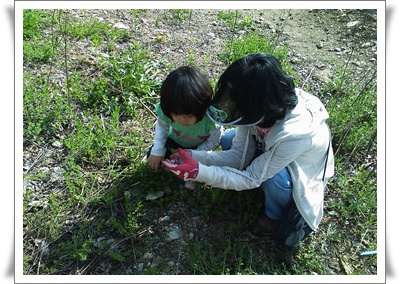
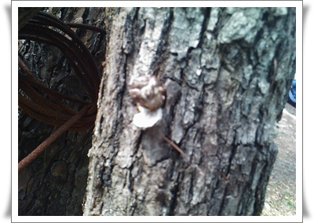
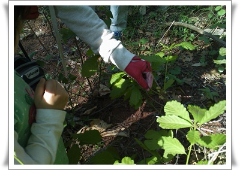

# 용인자연휴양림 숲해설

집에서 가장 가까운 자연휴양림인 용인자연휴양림.

아내 운전연습하는 코스겸해서 갔다.

[지난번 갔을 때](../10425220.html) 에는 사람이 없었는데, 이날은 날이 따뜻하니, 휴양림엔 사람도 차도 많더군.

용인시민에게는 무료개방이다보니, 특히나 사람이 많은 듯 했다.

물어보니, 주말에는 항상 바글바글댄다고 한다.

4시에 시작하는 숲해설을 신청했다.

자연휴양림으로 놀러가면, 줄곧 숲해설을 듣곤 했었다.

모이는 장소인 체험관앞으로 갔는데, 모인 사람은 우리 가족밖에 없더군.

숲해설이 홍보가 덜 되었나 보군.

암튼, 그 덕에 거의 개인 해설을 듣다시피 했다.

\- 딸래미에게 풀을 설명해주시는 숲해설 선생님.

\- 참나무에서 자라는 버섯.

\- 상수리나무인데, 거기에 생긴 벌레자루

\- 숲해설 선생님 따라 돋보기 가지고 살펴보는 딸래미

생긴 지 얼만 안된 휴양림이라 식물도 별로 많지 않은 거라 생각했는데, 설명을 들으면서 따라다니니, 그동안 눈에 안 보이던 식물들이 많이 보이더군.

