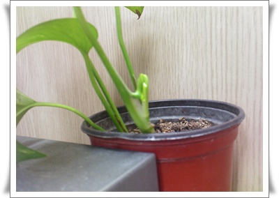
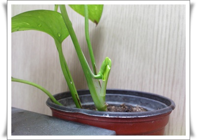
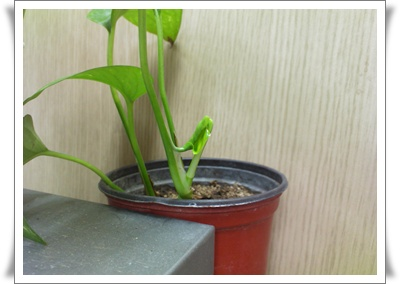
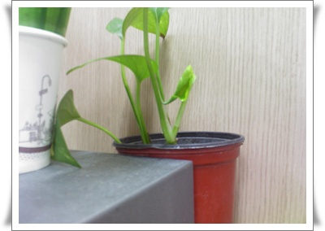
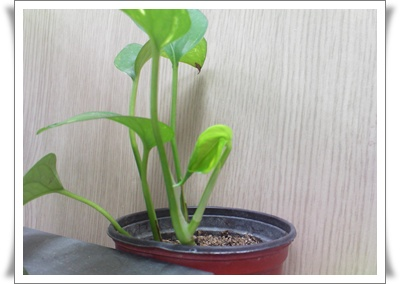
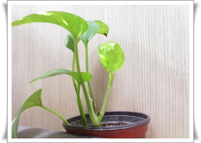

# 새 잎이 나고 있다

[회사 책상에 키우고 있는 식물](../10451187.html).

무려 5년간을 키우고 있는데도, 이름을 까먹었다.

새 잎이 나려하고 있어 찍어봤다.

\- 1일차

\- 2일차

\- 5일차

\- 6일차

\- 7일차

\- 8일차

\- 9일차

별 관심없이 봤을 때는 어느순간보면 잎이 나있었었는데, 하루하루 지켜보니, 서서히 나오더군.

