# 레간자 키박스 직접 교체해 봤다

중고차를 사면서 받은 키는 달랑 하나.

그런데, 그 키도 잘 안 맞았다.  한번에 안 돌려지고, 마치 차량 절도범처럼 여러번 돌려야 됐다.

보조키를 복사할까하다가, 지금 가지고 있는 키도 잘 안맞는데, 그걸 복사하는 것은 더 안 맞겠지 하며, 키박스 교체쪽으로 생각을 바꿨다.

인터넷으로 키박스 교체하는 공임을 검색해봤다.  적어도 5만원은 넘는 것 같았다.

아까운 공임비 생각을 하며, 다시 diy로 돌렸다.

대우자동차 부품 판매하는 인터넷 매장에서 키박스를 샀다.

가격은 23,320원.

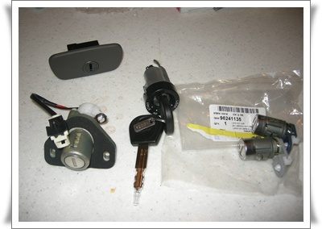

\- 이게 교체할 키세트. 시동키, 좌우문짝, 트렁크, 글로브박스 이렇게 5개가 한 세트다.

생김새는 단순했지만, 저거 장착비가 괜히 5만원이 아니었음은 작업하면서 깨달을 수 있었다.

암튼, 부품이 왔으니, 작업 시작.

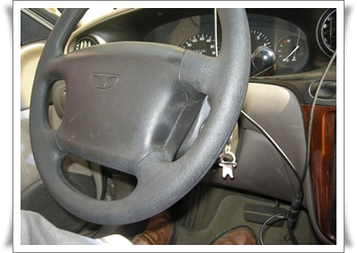

\- 시동키부터 먼저 교체하기로 했다.

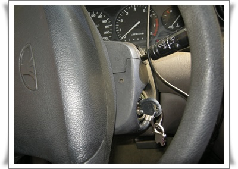

\- 핸드을 90도로 꺽어야 나사를 풀 수 있더군.  좌우 나사 2개 분해.

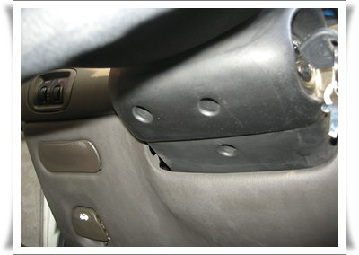

\- 핸들 밑에도 나사 세개를 풀었다.

나사 5개를 다 풀었으니, 커버를 벗겨야 하는데 어떻게 벗기나?

이역시 힘으로 벗기면 되었다.

탄성 있는 플라스틱이라, 오그라뜨리면서 잡아재끼면 빠지더군.

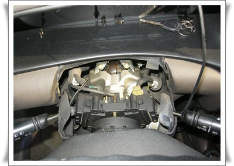

\- 위쪽 커버 탈착

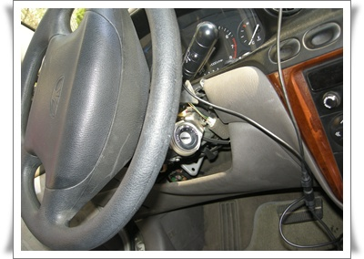

\- 아래쪽 커버도 탈착

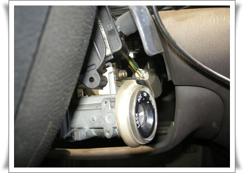

\- 이제 저 뭉치를 빼내야 한다

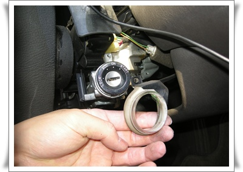

\- 테두리의 불 들어오는 것부터 제거했고,.

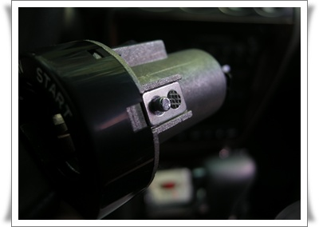

\- 키뭉치 옆에 멈칫쇠가 있는데, 이걸 누르고 빼야 빠지더군.

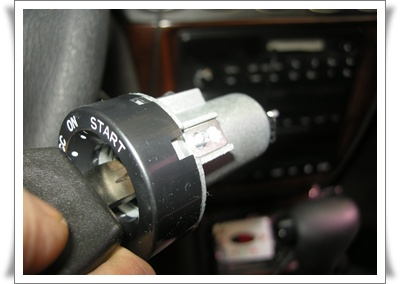

\- 제거한 구 키뭉치.

이제 새 키뭉치로 교체.

조립은 분해의 역순.  조립 시작.

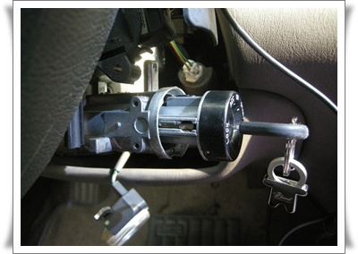

\- 새 키뭉치를 집어넣고, 핸들 원상 복구

여기까지 걸린시간 30분.

시동키가 제일 어려울 줄 알고, 시동키부터 시작했는데, 아니었다.

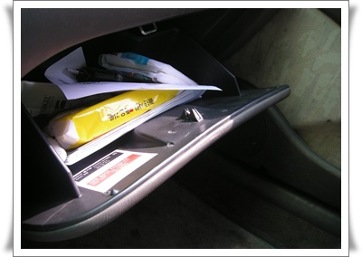

\- 다음은 글로브 박스.  그냥 나사 두개 풀고 교체하면 되더군.

다음 문짝.

이게 상당한 난이도가 있었다.

일단 뜯는 범위가 좀 크다.

암튼, 문짝을 뜯어야 작업이 가능하니, 문짝부터 뜯는다.

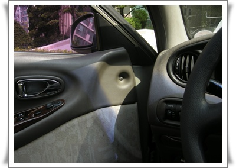

\- 문짝을 뜯어본 적이 없어, 일단 보이는 나사란 나사는 풀었다.

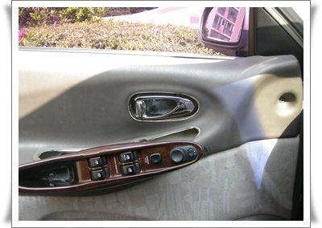

\- 파워윈도우 조작부도 빼고,

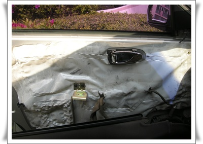

\- 도어트림까지는 탈착완료

\- 일단 여기서 난관 봉착.  그 틈사이에 보이는게 키뭉치인데, 저걸 풀어야 했다.

저걸 어떻게 푸나, 한참을 고심했다.

일단 문짝의 철판 사이에 너트가 있는 거라, 구조가 눈에 안 들어왔다.

한참을 구조 파악에 골몰했다.

이거 괜히 시작했나하는 두려움도 밀려오고...

한참을 조사한 끝에, 방법을 터득했다.

구조만 알면, 간단한 거였다.

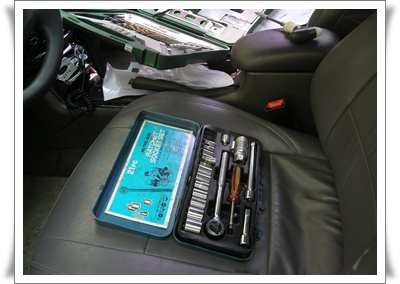

\- 10mm 복스를 풀기 위해, 복사셋을 꺼냈다.

저건 내가 중고등학교때 샀으니까, 무려 20년이 넘었군.

지금도 마찬가지지만, 어렸을 때도 공구는 '남자의 로망'이었다.

공구들만 있으면 맥가이버가 된 듯한 뿌듯함이랄까..

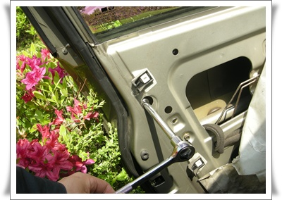

\- 복스알 끼워 풀었다.

그리고 철심이 두개가 문손잡이에 연결되어 있는데, 그걸 풀기 위해선 저 틈새로 손을 집어넣어 상당히 아크로바틱한 포즈로 해야 했다.

암튼 힘겹게 제거.

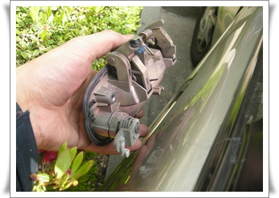

-제거한 손잡이. 왼쪽 튀어난 부분이 교체할 키뭉치다.  저거와 철심도 이어야 하고..

운전석 키뭉치를 분해하느라, 하루 에너지를 다 소모했다.

운전석 하고 나니, 온몸에 힘이 다 풀리더군.

조수석은 운전석과 동일한 방법으로 했다.

트렁크는 그냥 나사 두개 풀고 교체하면 끝.

걸린시간 2시간 30분.

30분은 시동키빼느라 소비.

2시간은 운전석 제거하는데 소비.

암튼, 이렇게 해서 5만원 공임 절약했다.

자뻑이겠지만, 아무래도 나 정비에 소질있는 것 같다.

