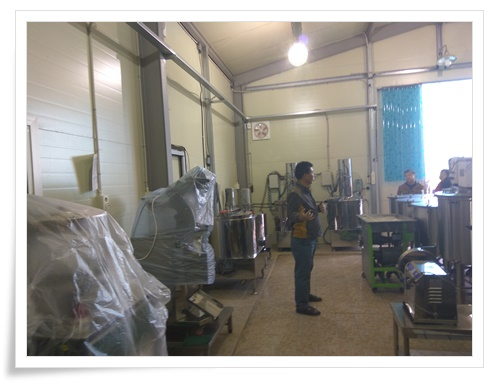
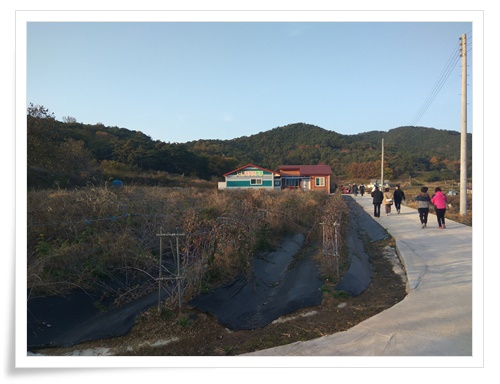
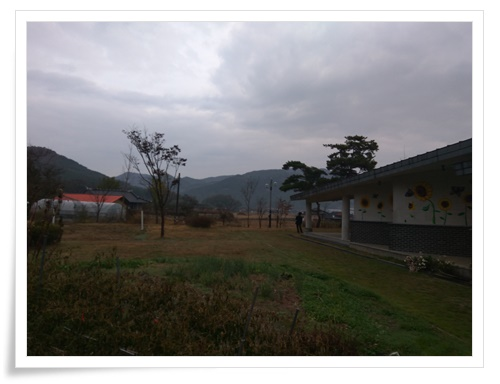
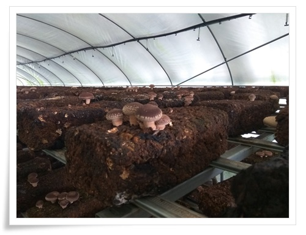
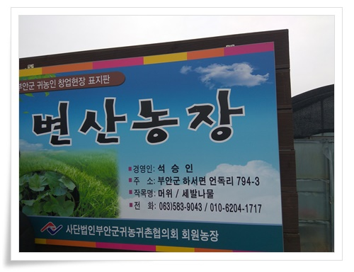
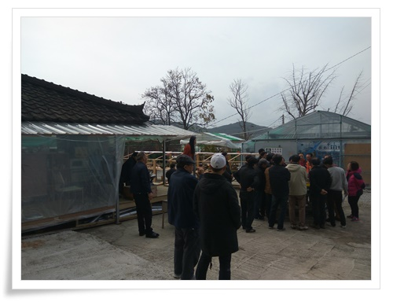
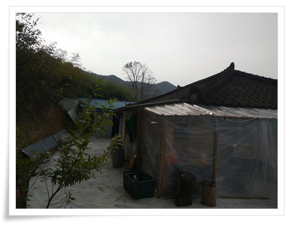
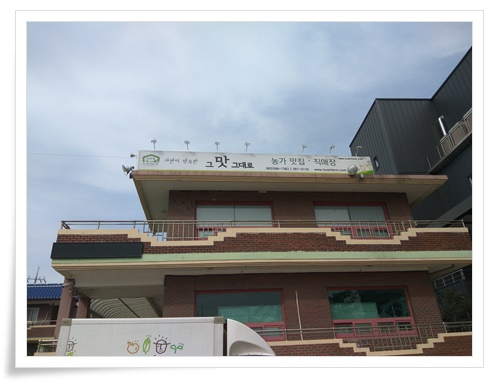
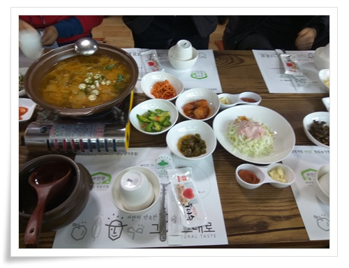
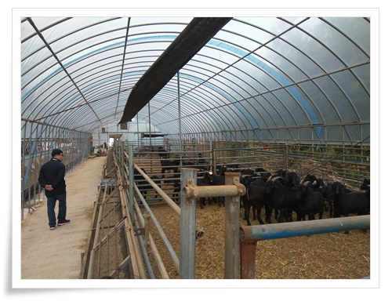

# 정읍,부안 귀농귀촌 교육 참가

전라북도 귀농귀촌지원센터에서 하는 1박2일 교육에 참가했다.

참가비는 3만원.

이 교육에 1인당에 들어간 비용이 한 20만원정도 된다고 하니 17만원정도를 전북 지자체에서 부담하는 것 같다.

출발은 방배역2번 출구에서 아침 8시 30분 출발.

그 시간에 맞춰 가기 위해 평소 출근하는 시간대에 일어나 집을 나섰다.

\- 버스에 타자 교육 기간 간식거리를 받았다.

참석한 사람들의 나이대는 50대 초반에서 70대까지.

내가 제일 어린 사람 같았다.

이번 교육 장소가 정읍, 부안이라서 버스는 전북까지 내려갔다.

\- 점심시간 다 되어 도착한 정읍시.

식사 장소는 한우만.

메뉴는 설렁탕인데 맛있게 잘 먹었다.

\- 첫번째 선도농장으로 엽채류를 재배하는 비녀골 농장

띄엄 띄엄 놓여 있는 마시멜로가 이제 추수가 다 끝났음을 알려준다.

\- 여러 종류 채소가 자라고 있었다.

이 농장에서는 주로 로컬 푸드로 납품하고 있다고 한다.

\- 2번째 6차산업 선도농가인 오복야

앞에 서 계신 분은 1박2일 동안 인솔하느라 수고하신 지원센터 직원분.

\- 가공 시설에 설명을 하는 오복야 사장님.

나도 이런 창고 하나 있으면 좋겠다.

\- 다음 행선지는 굼벵이 사유 농가인 전북굼벵이.

집에 들어선 위치가 나즈막한 산에 둘러쌓여 좋다.

\- 말린 굼벵이.  이 농장에서 사육한 것으로, 먹을 만은 했으나 그리 썩 땡기는 맛은 아니다.

현재 굼벵이는 주로 약용으로 팔린다고 했다.

향후 곤충식량으로도 준비를 하고 계신다고 했다.

\- 성심껏 가르쳐 주시는 전북굼벵이 사장님.

예비 귀농인에게 이렇게 자세히 가르쳐 줄 수도 있구나라는 감탄이 나왔다.

자칫 미래의 경쟁자가 될 수도 있는 사람들인데 말이다.

귀농 하기전부터 회사 생활하면서 몇년 동안 준비를 하셨다고 한다.

\- 깨끗한 굼벵이 사육 시설.

\- 저녁은 우동 우리밀 마을 숙소에 있는 식당에서 생선찌게.

역시 깔끔하니 맛있다.

\- 숙소인 잔 우동 우리밀 마을.

나즈막한 산으로 둘러쌓여 포근한 느낌이 드는 마을이다.

\- 내가 잔 곳은 무형문화재전수관.

우리밀마을 숙소로는 잘 곳이 부족하여 나 포함 5명은 이곳에서 잤다.

다음날 아침 7시30분 아침을 먹고, 교육 일정이 계속되었다.

이 날 첫 교육은 부안군의 버섯농가

\- 표고버섯 재배하는 "버섯천지"

이 분도 귀농한지 몇년은 안되었는데도 철저한 준비로 성공하셨다.

\- 버섯 재배 하우스

\- 원목에 키우는 방식이 아닌 가공톱밥에 재배하는 방식이다.

\- 다음으로 참머위와 세발나물 재배하는 변산 농장 방문.

\- 참머위 파종한 비닐하우스를 보여주는데, 참 유쾌하신 분이었다.

싹이 제대로 안 나 실패한 하우스라고 한다.

\- 이건 세발나물.  먹어본 일이 없어 뭔지는 잘 모르겠다.

\- 다음 방문지.  다육 식물을 키우는 다육마실.

\- 아담한 집이 마음이 든다.

\- 다육 키우는 하우스 내부

\- 점심은 마을공동체에서 운영하는 것 같은 식당인 '그맛그대로'

\- 역시 정갈하니 아주 맛있다.

\- 마지막 방문 농가인 그래그래흑염소.

아주 만족스런 교육이었다.

물론 성공 사례들만 찾아 본 것이라, 그렇게 성공하기까지 얼마나 많은 노력을 했는지는 체득하기는 힘들 것이다.

그래도 많은 도움이 되었다.

