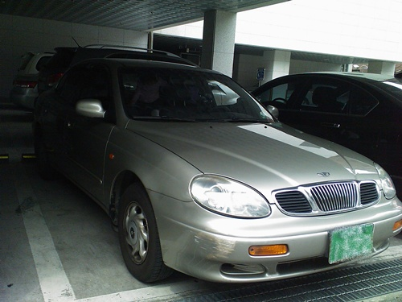

# 내 첫 가솔린 승용차 레간자

아내가 운전면허를 배우더니, 차를 사 달란다.

럭셔리 카니발이 있으니, 그거 운전하라고 하는데, 자기는 자동이 필요하단다.

그래서 엄청난 출혈을 하며 산 럭셔리 세단.  레간자.

1999년식, 19만km주행한 이제 막 길들여진 차다.

거금 70만원을 주고 직거래로 샀다.

차량등록비(대행료포함) : 118,000원

종합보험료 : 290,000원

자동차정비 : 400,000원 ( 브레이크오일교환, 디스크라이닝교체, 미션리테이너교체, 타이밍탈부착과 크랭크실작업 )

도합 150만원이 실질적인 구입비용이로군.

록스타->갤로퍼->카니발  경유차만 타다가 휘발유차 타니, 기름 많이 잡아 먹더군.

카니발 연비가 11.5km정도 나왔는데, 레간자는 고속도로 주행을 했는데도, 8km정도밖에 안나오는군.

수동만 몰다가, 자동을 운전하니, 운전도 영 재미없고, 시동걸때마다 혹시나 급발진하지 않을까 걱정도 된다.

높은 차만 타다가, 낮은 차 타니, 땅에 붙어 운전하는 느낌으로 바로 앞차밖에 안 보이 영 답답하다.

