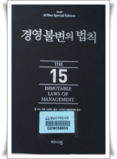

# [책] 경영불변의 법칙

우리나라에서 SW개발자의 경력은 극히 일부를 제외하면 관리자가 되거나, 아니면 통닭집을 한다는 것이 정설이다.

개발보다 관리일이 더 많은데, 없는 경험을 무엇으로 보강할 것인가?

다른 사람의 경험밖에는 없지.  그중에 책이 제일 낫겠고..

"경영불변의 법칙"과 "마케팅불변의 법칙"이라는 책을 읽었다.

이 책에서는 "사업다각화", "융합", "컨버젼스"  이런 용어들을 회사 망하게 하는 선택으로 간주하고 있다.

"선택과 집중", "고도의 집중화"  이것만이 살 길이다

책에 여러 성공사례와 실패 사례를 설명해주며, 집중화의 당위성을 설명을 하고 있다.

지금 내가 다니는 회사가 솔루션 한분야만 집중화한 회사다.  그런데 이 곳의 수익성이 자꾸 떨어지고 있다.  그래서 이 책에 말하는 망하는 지름길 사업다각화를 모색하고 있는데, 이게 참 걸리는군.

이제까지 읽었던 실용서적, 입문서와는 차원이 다르게, 머리에 쏙쏙박히게 해주고 있다.

그나저나 산업용PDA용 프로그램에도 우리회사 제품군이 있는데, 아이폰, 안드로이드, 윈도우7폰이 어떻게 이 시장을 바꾸지 참 궁금하군.

예측을 잘 해야 대처도 잘 하는데,..

