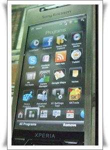

# 엑스페리아 롬 업글 돌아설 수 없는 길에 들어섬

악의 구렁텅이 롬 업그레이드에 빠졌다.

엑스페리아 사기 전부터 롬 업그레이드에 빠지지 말라 글을 많이 봐왔었다.

여러가지 종류의 롬들이 있어, 선택의 자유가 많지만, 그게 마치 성형중독과  같다고 한다.

성형이라는게 아예 안 한 사람이 있어도, 한 번만 한 사람이 없다는 말처럼, 처음할 때는 두근거리며 하다가, 한번 하고나서 효과를 보고 나면 계속 한다더군.

롬 업그레이드도 한번 하고 나면  허구헌 날 이롬, 저롬 계속해서 롬만 업그레드하는 폐인생활이 된다는 경고에 순정에 만족하려고 했었다.

하지만, 아이폰 전도사 경률씨의 현란한 말솜씨와 아이폰 시연 이 후, 도저히 내 엑페를 그대로 볼 수가 없었다.

아이폰에 대한 뽐뿌로, 내 엑스페리아가 너무 형편없어 보였다.

그래서 결국 롬 업그레이드 결정.

가장 좋은 평가를 받고 있는 [진욱롬](http://ackbarix.iptime.org/xe/?mid=DomesticEX3&document_srl=56575) 으로 했다.

폰에 저장된 정보를 어떻게 백업받을까 하다가, 연락처는 그냥 구글메일 싱크하기로 하고, 문자메시지 그딴 거 필요없고, 전화내역 필요없고, 그래서 과감히 백업도 안하고 밀었다.

이렇게 해서 짜잔 새 엑스페리아로 재탄생.

이제 이걸로 한동안 견디어 내면 되겠다.

