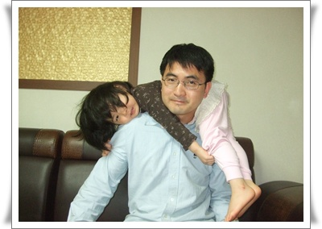

# 토끼 목도리

딸래미가 내 목을 올라타더니, "아빠! 목도리야" 하는 거다.

-딸래미가 몸으로 만든 목도리

동화책에 여우가 목도리처럼 동화책 주인공에 목에 붙어 있는 그림이 있던데, 그걸 보고 따라한 모양이다.

딸이 키우는 재미가 있다고 말하는데, 바로 그 재미로군.

딸이 있어 행복한 순간.

1\. 내 품에서 잠 들 때.

\- 내 무릅에서 TV보다가 사르르 잠을 들때가 있다.  그 때 '내 품이 얼마나 안락했으면 이렇게 잠이 드는구나' 하면서, 행복한 착각에 빠지곤 한다.

2\. 늦은 아침, 잠에 깰때, 눈 잠깐 뜨고 내 얼굴 확인후 다시 잠을 잘 때

\- 이 역시 내 얼굴을 보며 얼마나 편안했으면 안심하고 다시 잘까하고 착각한다.

3\. 잠에서 반쯤 깨어, 졸린 눈으로 침대에서 완전히 깰때까지 그냥 누워서 같이 놀 때.  그 후엔 기운이 너무 쌩쌩해 힘들다.

4. 자면서, 자기 발을 내 얼굴위에 툭하니 올려 놓을 때.

5\. 내 팔베게하고 잘 자고 있을 때.

암튼, 이런 시기도 앞으로 불과 몇년이니라서, 이게 더더욱 소중하게 느껴지는 것일지도 모르겠다.

평소 아침잠이 없는 내가 주말이면 늦잠을 자고, 놀러도 잘 안가는 것도 딸과 이렇게 노는게 더 재미가 더 커서다.

