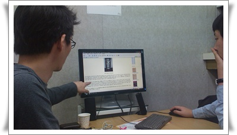

# 삼색볼펜 초학습법으로 스터디 결성

삼색볼펜학습법이라는 것을 알게 되어 2007년쯤에 해 봤었던 적이 있었다.

공식적, 비공식적으로 아무 프로젝트도 하고 있던 시기가 반년가까이 되던 시기가 있었다.

대놓고 놀수는 없고, 대부분 사람들의 컴퓨터에는 그냥 쓸데없이 4시간이나 걸리는 빌드나 걸어두고, 딴짓하곤 했었다.

그 시절엔 주간회의 보고서 쓰는게 참 힘들었다.  쓸게 없는데 제출하라고 하니..

그 때, 모두 다 전임시절이었던 김대원전임, 임동주전임과 같이 매일 오후 두세시쯤 30정도 삼색볼펜펜초학습법으로 스터디를 했었다.

위키피디아에서 업무관련 주제 하나를 가지고 했었다.

이 학습법은 예습을 필요로 하지 않는 거였고, 짧은 시간 고도의 집중력을 요하는 거라, 시간에 대한 압박감과, 자기만 모른다는 쪽팔림으로 놀라운 집중력으로 진행될 수 있다.

하는 동안 꽤 스터디 진행이나 성과도 나름 괜찮았는데, 튀는 행동 하지 말라는 상부의 억압에 의해 한달정도만에 중단되었다.

그로부터 3년이 지난 지금, 다시 한번 시작했다.

주제는 아이폰앱개발 수박겉핢기 프로젝트.

구성원은 전직장 동료 임동함선임, 김대원선임.

시작하게 된 계기는?

김선임이 미국 출장가서 사이 맥미니와 아이팟터치를 충동구매한 기념으로 아아폰앱개발 유행을 따라가보기로 했다.

첫 킥오프미팅은 강남역에 있는 윙스터디.

요즘 이런 스터디 모임이 많아서 그런가, 이런 세미나 장소만 제공하는 곳이 있더군.

두시간에 9천원.

간만에 해본 삼색볼펜법이라 다 까먹었다.

[삼색볼펜초합습법소개페이지](http://agile.egloos.com/3684946) 를 열고, 다시 방법을 알아본 후 진행.

각자 오늘 공부할 분량을 가지고,

20분 삼색볼펜으로 밑줄을 긋고, 10분간 밑줄 그은 것을 읽으며 설명.

역시 아무리 가까운 사이라도 이렇게 시간 제약속에 읽고, 설명하고 하니, 놀라운 집중력으로 진행이 된다.

이날 한 분량은 제 2장.

한편 이날 우리 옆 방에는 무슨 취업 준비 모임인지, 면접 연습하는 소리가 들렸다.

들리는 소리로 봐서, 한명이 면접자가 되고, 나머지는 면접관이 되어 서로 단점 지적하는 모임인가 보다.

나 대학때도 졸업반을 대상으로 아무 도움안되는 면접실무 특강이라는 것을 하기는 했으나, 요즘은 저런 면접준비조차도 치열하구나.  88만원 세대는 참 불쌍하구나..

