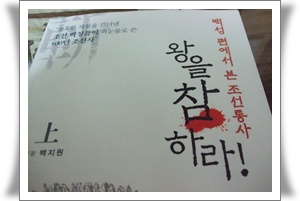
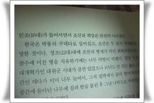
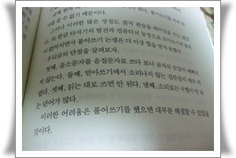

# [책] 아주 찜찜하게 읽은 책 '왕을 참하라'

제목이 상당히 거칠다.

보통 이렇게 제목 뽑는책들이 낚시가 많긴 한데, "사서가 추천하는 책들"에 선정되고 한 책이라 읽기 시작했다.

베스트셀러에도 올랐던 책이였더군.

상당한 자신감으로 씌여진 책이였다.

그런데, 사학전공자가 아니라, 외대 스페인어과 전공했고, 남미로 이민간 재미사학자라는게, 좀 매치가 안되더군.  꼭 버클리음대에서 화학을 전공한 사람이라는 우스개말이 떠오르는 듯 하다.

재야운동권은 말이 되어도, 재야사학자는 좀 그렇다.

비주류라는 말을 곱게 쓴 것 같은데..

암튼 백성 편에서 본 조선통사라기에 읽기 시작했다.

이제까지 역사는 승자의 역사니 하는 말들로 시작하기에, 옳거니 하고  제대로 된 사관으로 된 책이군이라 생각을 했었다.

읽다니보니, 좀 이상한 기분이 들었다.  뭔가 억지를 부린다는 느낌.

그러다, 85페이지에 와서 "한국은 박통의 쿠데타로 일어섰고,.."라는 문장을 읽고서, '쓰레기책을 빌렸구나'하는 후회가 들었다.

제대로 된 사관을 가진 사람이 개인의 야욕을 위해 쿠데타를 일으킨 독재자를 찬양할 리는 없다. .

이제 본격적인 비판적인 눈으로 어떻게 쓰고 있나 쭉 읽어 봤다.

한글 모아쓰기에 대해서도 지극히 서양적인 시선으로 바라봤더군.

알파벳처럼 풀어쓰기를 해야 한다는 주장이었다.

즉.  "한글사랑"을 "하ㄴ그ㄹ사라ㅇ"으로 풀어써야 한다는 주장.

80년대 컴퓨터에서 2바이트체계의 한글에 영문도스에서 문제될 때, "왜 한글은 쓸데없이 두바이트나 되서 고생인가"라고 푸념하는 소리와 매한가지 주장이겠지.

384페이지에서 본색을 드러내더군.

**"요새 참 민간단체인 역사 무슨 위원회인가에서 친일인명록을 발간한다고....  사실 일제 식민지 시절에, 특히 일부인 독립운동가들 빼고 일제에 협력하지 않고 살 수 있었는지..."**

하면서 민족문제연구소의 친일인명사전발간을 조롱하더군.

바로, 뉴라이트에서 내세우는 논리다.

대표적인 친일파 서정주도 끝까지 자기 친일행위에 대한 반성없이 죽었다. 자기는 무슨 "친일 아닌 종천순일"이라 뭐라 하면서,..

하도 찝찝하여 인터넷 서점에서 저자소개를 뒤져봤다.

역사공부를 어떻게 했다는 내용은 찾을 수 없었다.

"역사 공부한 흔적이 없는 사학자", 이말은 "의대 안 나온 의사", 혹은 "정식교육도 받지 않고 무한동력엔진을 만드는 과학자"와 비슷한 것이 아닐까?

일단 상권은 끝까지 읽었는데, 소감은 "조선이란 나라는 아주 창피한 지리멸렬한 나라"라는 것을 느끼게끔 한다.

마치 네이버지식인을 스크랩하여 재가공한 듯한 역사소설같다.

출처도 명시안되어 있으니, 과연 내용들도 정말일까하는 의심이 간다.

