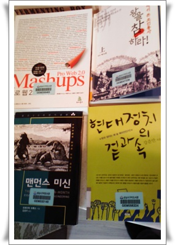

# 이번주 출퇴근시간에 볼 책 들

이번주 도서관에서 빌린 책들

[하루 4시간을 출퇴근에 보내는 통](../9364023.html) 에 책 많이 읽는 독서인이 되어가고 있다.

책을 보는 시간은 그중에도 특히 퇴근시간 두시간.

짧은 분량의 책 같은 경우에 하루에 다 보기도 한다.

책을 보다보니, 꼬리를 물고 더 보고 싶은 책들이 많아지더군.

예전에 이 책을 읽었다면 훨씬 더 좋았을 텐데라는 후회가 들게 만드는 책들도 있고..

가까이에서 책을 빌릴 수 있는 성남시 구미도서관과 분당도서관에 고맙다.

내가 내는 세금에 가장 만족을 주고는 곳이다.

