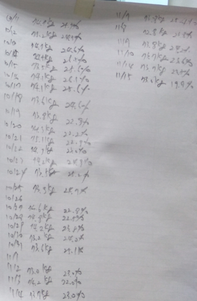

# 다이어트 시작 석달 후

운동도 거의 안하면서 먹기는 많이도 먹어 몸무게가 계속 불어났다.

무게가 늘어나는 것에 대해 자각을 하고 있으면서도 실행에 옮기지는 않았다.

다이어트에 대해 그다지 절실함을 느끼지 못했다.

그런 안이한 생각이 무게 82.5kg까지 되는 지경에 이르렀다.

어머니가 내 뱃살을 보더니 빼라고 했다.

그렇게 살 많이 찌면 네 아버지처럼 일찍 죽는다면서..

암튼 다이어트에 대한 계기가 생겼다.

바로 실행에 옮겼다.

다이어트 방법으로는 먹는 것을 줄이고, 운동을 한다는 아주 기본적인 것을 실천하기로..

1차 목표는 78kg으로 정했다.

78kg도 과체중 상태의 무게이기는 하지만 이게 최근 2~3년간 유지된 무게였으므로 이 정도로 정했다.

그 무게에 도달할 때까지 저녁은 굶기로 했다.

그리고 저녁 마다 탄천에 나가 2km 뛰고, 공원에 비치된 운동 기구 특히 평행봉을 했다.

\- 시작후 무게가 줄기 시작했다.

초기니까 주로 몸의 수분이 빠져나가는 것으로 보인다.

저녁을 굶는 것에 대한 것은 꽤나 인내력을 요구했다.

오후만 되면, 머리속에 온통 먹을 생각 뿐이었다.

\- 다이어트 시작 3주차에 드디어 78kg 밑으로 떨어졌다.

그래서 1차 다이어트 종료.

이후 이 무게를 유지하는 것으로 바꾸는 것을 변경했다.

다시 저녁은 먹기 시작했다.

요요 현상이 오는 막기 위해 운동은 계속 하고, 먹는 것도 밥 양을 1/3 줄인 것을 계속 유지했다.

그리고, 자전거로 출퇴근.

\- 11월15일 현 무게 73.0kg.  석달전에 비해 9.5kg이 빠졌다.

살 빼는 데는 확실이 먹는 양을 줄여야 하는 것이 맞나 보다.

그리고 요즘 유행하는 저탄수화물고지방 처럼, 탄수화물 양 줄이는 것이 좋은 결과인 것 같다.

무게를 줄이니 확실히 달리기하는 데도 힘이 덜 들고, 평행봉 할 때도 몸이 가볍긴 하다.

다시 비만 상태로 돌아가지 않도록 배 터질 때까지 먹는 것이 아닌, 배 부를 정도만 먹는 것을 지켜나가야겠다.

