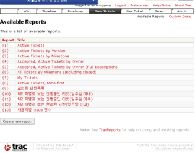

# 소기업에서 trac 효과적으로 사용하기

소기업들이 거의 그러겠지만, 대부분  개개인 능력에 의존한다.

그래서 누구 하나 휴가가면 담담하는 일뿐만 아니라 연관되는 일까지 차질이 빚는 일이 많다.

우리회사도 이러한 것을 개선해보고자, 맨처음 도입한 것이 위키, 그다음 서브버전었다.

위키를 쓰면서 사내지식이 축적되고, 소문이 없어지고, 반복적인 시행착오가 줄어들었다.

서브버전을 쓰면 사이드이펙트가 줄었다.  그리고 개발능력이 전반적으로 향상되어지는 것 같았다.

하지만, 아직 남아있는 문제들이 있었다.

\- 이슈가 발생해도 사내에서 제대로 공유가 안된다.

\- 고객에게 언제까지 해주겠다고 약속을 해도, 전달하는 과정에서 그 약속에 대한 내용이 오해되는 일도 많다

\- 약속된 시간이 있었는데, 다른 일이 생겨 시간이 미뤄지는 일이 허다하다

\- 일이 미뤄지다 보면, 아예 까먹고 진행안시키는 일도 많고, 나중에 고객이 채근하고서야 그런 일이 있었음을 알게 되는 일도 있다.

\- 고객에게 어떤 약속할 때 예상 추정 시간을 확신할 수 없다.

이슈관리툴을 쓰기로 했다.

내가 써본 툴은 buzilla, mantis, clearquest 이 세개가 전부.

대세에 따르고자 Trac을 하기로 했다.

trac은 예전 2002년도 쯤 동함이 자기 노트북에 trac설치했다고 보여준 것을 보고, 괜찮아보이네 했던 기억이 있는 툴이다.

사내커뮤니케이션툴로 모니위키

버전관리툴로 SubVersion

이슈관리툴로 Trac

이 세개를 다 도입함으로써 일단 소기의 목적은 달성했고 정착시키는 일이 남았다.

아무리 좋은 시스템이라 그것을 쓰는 사람이 올바로 사용하지 않으면 무용지물이니 잘 사용하도록 사람이 노력해야 한다.

개발팀뿐만 아니라, 전직원이 trac을 사용하도록 하고, 그것을 강제하기 위해 자기가 시작해 자기가 끝내는 일이 아닌 것에 대해서는 전부 trac에 이슈로 등록을 하도록 했다.

물론 trac에 변경사항이 있을 때마다 담당자와 CC된 사람들에게 메일이 가도록 했다.

trac의 기본 상태가 New -> Assigned -> Accepted -> Closed 이다.

이전 회사에서는 Closed  전 단계가 Fixed 였고, QA만이 Fixed를 Closed로 바꿀 수 있었다.

Fixed 상태를 추가할까 하다가, 툴에 사람을 맞춰야지 사람에 툴을 맞추면 안된다는 신념에 따라 툴에 프로세스를 맞추기로 했다.

어차피 프로세스 자체가 없기도 했고, 기본 설정이 저렇게 된 것은 다 그럴 듯한 이유가 있을 것이기 때문이라 생각이 있었다.

이슈관리툴을 쓰기 시작했고, 이를 잘 쓰도록 해야 한다.

이전 회사에서는 단순히 issue 숫자가지고만 매주 통계를 내서 어느정도 진척이 되었다는 것을 알려줬는데, 숫자만 가지고 하기엔 좀 맞지 않아 보였다.

그래서 만든게 이슈회의.  매주 목요일 10:30분터 전직원 모여 이슈회의를 하는 거다.

빔프로젝터로 trac하면을 투사한채로 전직원 회의를 하는 거다.

1단계로 이번주 closed된 이슈를 close한 사람별로 죽 설명하고, 다른 사람들이 제대로 close된 것인지 듣다가 아니다 싶은  reopen하도록 하여, issue close를 확인하고,

2단계로 이번주 신규등록된 이슈를 현재 assigned된 사람별로 죽 설명을 하면, 관련있는 사람들이 일정이나 해결방안에 대해 말을 한다.

3단계로 한주가 지나도록 close되지 않고 계속 열려있는 이슈를 설명하도록 했다.

이렇게 진행되는 이슈회의는 길게는 2시간, 보통 1시간정도 진행이 되고 있다.

Code inspection과 마찬가지로, 이슈회의도 보통 버그와 관련된 이슈가 많은데, 그렇다보면 이것에 대해 이전 회사들에서 담당자는 방어적인 자세를 취하고, 다른 사람은 공격하는 자세를 취하는 것들을 많아 봐 왔기 때문에, 이 현상은 제거하고자 하여, 사람을 비난하는 일은 없도록 노력하고 있다.

trac 도입 넉달째.

아직 완벽하지만 않지만, 그래도 우리회사에 완전 정착한 듯 싶고, 기대했던 효과도 나오고 있다.

이슈에 대한 공유도 잘 이루워지고, 내말이 맞니 너말이 맞니하며 오래전 기억을 뒤집으며 하는 말싸움도 줄어들었다.

