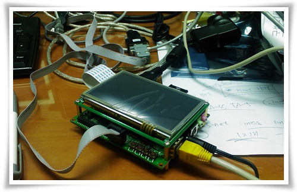

# 임베디드  리눅스 삽질의 연속...

임베디드 바닥을 떠난지 2년이 되어, 다 까먹었데 임베디드 시스템을 개발할 일이 생겼다.

DVI 출력기능이 필요하여, dvi 출력이 되는 개발보드를 알아보니, 하나밖에 없더군.

중국에서 만든 devkit8000.  가격은 4.3인치 lcd 포함 39만원.

주문했는데, 물량이 없다고 열흘이 걸린다고 하더군.

배송될때까지 개발환경 세팅.

간만에 써 본 리눅스는 많이 낯설더군.

우분투 9.10 서버 버전을 깔았다.

헌데, 9.10에 포함된 grub2가 설치한 컴퓨터와 잘 안 맞는지, grub모드에서 키보드가 먹통이 되어 해결하는데 삽질하다가 결국 grub만 다운그레이드했다.

개발할 보드는 X윈도우없이 직접 framebuffer를 사용할 것이기에, 우분투에도 framebuffer 설정을 했다.

매뉴얼대로, 구글의 갖가지 해답들을 찾아 시도해도, /dev/fb0가 안 나타는 거였다.

리눅스의 배포본 종류와, 그 버젼들이 따라 다 해답들이 다 다른데, 9.10의 해답이라고 나와 있는 것도 서버버젼에는 해당사항이 없었다.  이틀의 삽질끝에 서버버전의 모듈로딩 스크립트가 framebuffer 가 올리지 않는다는 찾아내서, 결국 두줄 고쳐 framebuffer 생기게 했다.

그리고, 우분투 서버버전의 framebuffer에 직접 이미지 출력하는 프로그램 C로 날코딩.  한동안 객체지향언어 했다고  C 날코딩도 어렵더군.   이어서 크로스컴파일러 gcc 3.4 설치하고, 크로스컴파일.

열흘의 기다림끝에 보드 도착.

달릴 것 다 달렸는데도 크기가 꽤 작다.

개발보드를 받았으니, 정상적인지 확인.   기본적으로 들어있는 바이너리로 nand로 부팅 확인.  pc와 시리얼 연결 시도.  이런..  보드와 연결이 안된다.  login console이 떠야 하는데 안 뜬다.   한참을 삽질했는데 결국 내 컴퓨터의 usb2serial 문제였다.

시리얼 연결은 되었고, tftp와 nfs 연결도 해야 하는데, 아무리해도 tftp 접속이 안되는거다.  우분투 서버 세팅의 문제다.  결국 포기하고 windows용 tftp 서버 설치하여, windows로 연결.

이더넷을 활성하기 위해 ifconfig eth0 192.168.123.31 하는데 eth0 up/down 메시지만 주구장창 뜬다.  구글링로도 해결못하고 일단 포기.

기본 커널 바이너리가 console 출력을 framebuffer로 하는 거라, 이것을 바꾸기기 위해 make menuconfig해서 framebuffer console제거하고 커널 컴파일.  30분 컴파일 끝에 뜬 drm\_gpu쪽의 에러 메시지.  알고 보니, make distclean하여 .config을 날려버렸던 거였다.

새로 빌드한 커널은 일단 tftpboot로 제대로 동작하는 것 확인한 후, nand에 flash하려는데, u-boot의 nand erase명령 문법이 궁금하여 nand erase 만 하면 도움말이 뜰 것 같아 그렇게만 치고 엔터 눌렀는데, nand를 싹 지워버렸더군.  jtag도 없는데 낭패였다.  이사태를 어떻게 해야 하나 하며 후배에게 도움요청.  TI칩은 시리얼 다운로드 기능이 있다고 한다더군.  알고보니 DM64xx시리즈만 해당.  내 꺼는 OMAP35xx 시리즈.  좌절속에 한참을 또 구글링만 하다가 sd 부팅이 되는 것 확인하고, sd에 리눅스 바이너리 설치하여 부팅시도.  안되더군.  알고보니 hp usb format 프로그램으로 부팅가능한 sd로 포맷을 해야한다더군.

리눅스.. 쉽지 않군..

