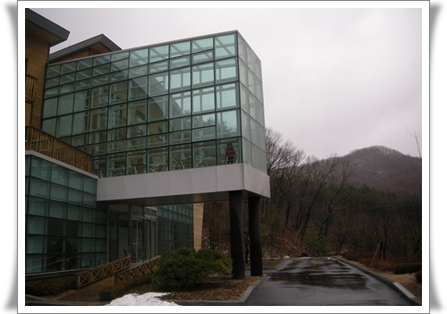
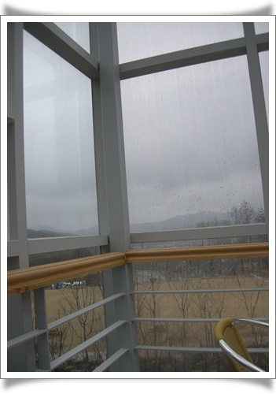
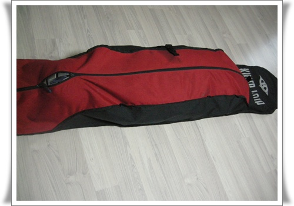

# 비오는 날 용인자연휴양림 산책

봄의 첫날, 비가 제법 많이 왔다.

비가 오면 몸이 근질거려 집에만 있기 아깝다.

폭우속의 질주를 좋아하는터라, 제법 많이 오는 겨울비에 차를 끌고 나섰다.

목적지는 작년에 개장한 용인자연휴양림.

네비에 용인시 처인구 모현면 처부리 산21-1번지를 찍었다.

위치는 에버랜드 근처더군.

집에서 30분정도 가니 도착.

대인 2,000원, 주차료 3,000원 합 5,000원을 내고 입장했다.

동행한 딸래미는 만 4세 미만이라 무료입장.

연휴마지막날이고, 비가 와서 그런가 한적했다.

체험관 외관.  통유리가 마음에 들어 들어가봤다.

4면 통유리를 통해 보는 비오는 바깥 풍경이 좋았다.

산림청에서 운영하는 경기도나 강원도쪽 자연휴양림보다는 규모면에서 좀 작기는 했으나, 작년 개장한터라 시설이 깨끗한 신형이고, 숲속놀이터가 잘 되 있었다.  야영데크도 있어, 봄에 캠핑하러 와야겠다.

겨울도 끝나고 하여, 올시즌 딱 한번 탄 스노보드는 다시 장롱 위로 집어넣었다.

이제 구입한지 10년째가 되는 보드셋.

지난해까지만 해도 겨울만 되면 가슴이 설레였었는데, 올해는 아니더군.

스노보드보다 더 재미있는, 딸래미와 노는 것에 빠져서 그렇다.

부시시한 눈으로 딸래미와 늦잠자는 것도 좋고, 같이 아침에 놀다가, 도서관 같이 가는 것도 재밌고..

