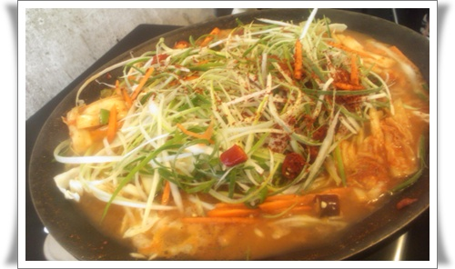
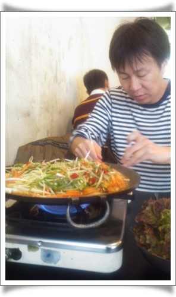
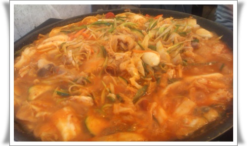

# 매우 그리웠던 삼일정육식당 돼지불고기백반

유티를 다녔을 때, 일주일에 한번정도는 점심먹으러 갔던 곳 삼일정육식당.

실내, 실외 모두 그리 청결과는 거리가 멀어보이지만, 맛만큼은 견줄곳이 없었다.

점심식사때면, 실내뿐만 아니라 건물 뒷편에 야외식탁까지 사람이 꽉 찼다.

그래서 보통 메뉴를 돼지불백으로 선택했다면 12시가 되기 전에 출발해야 했을 정도로 인기가 많았다.

많이 그리웠었다.  못 먹은 지 2년이 다 되어갔다.

가끔 그 근처로 옛 동료 만나러 갈 때도 그 걸 먹고 싶었지만, 이게 점심때밖에 안하는 거라 먹기가 쉽지 않았다.

그러다 드디어 먹었다.

이 식당의 점심메뉴는 이것 돼지불백하나 밖에 없다.

들어가면, 몇명인가만 물어보는 것으로 끝난다.

차돌백이처럼 얇게 썬 돼지고기에 파채와 김치 등을 넣고 끓여먹는다.

같이 먹은 진원씨

다 요리되어 이제 먹을 차례.  다시 사진으로 봐도 군침이 고이는군.

간만에 먹어서 그런가, 정말 맛있더군.

삼일정육식당 이곳이 그냥 이 근처 직장인들에게만 유명한 식당인 줄 알았는데, 구글 검색해보니, 맛집으로 소문난 곳이었더군.

