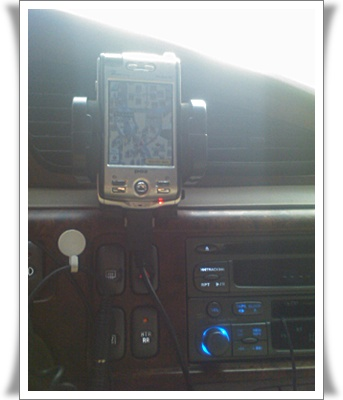

# 티맵 한번 사용 요금 

금요일 저녁, 수원에서 가산동으로 가야했다.

거리상 30km정도 거리.

가지고 있는 네비로 목적지를 찍고 출발.

2005년 동함에게서 33만원주고 산 poz301+ 네비게이션셋.

2003년산이니까, 이제 7년된 장치로군.

네비가 알려준 경로는, 그냥 경로상 최단시간 거리이지만, 교통상황을 고려하지 않은 경로라서, 알려준 경로로 가니까 그냥 차가 쭉 서있더군.

핸드폰 엑스페리아에 내장된 티맵을 써보기로 했다.

티맵의 평이, 도로교통정보를 잘 반영한 알고리즘으로 막힌 길 잘 우회해 알려준다고 하길래 믿어보기로 했다.

실수로라도 데이타 통신 나가가는 것을 방지하기 위해 설치한 NoData 프로그램에서 grps enable로 바꾸고, 목적지 설정.

티맵은 영동고속도로를 타고 가는 경로를 알려주더군.  예상 시간 1시간 20분.

실제 도착했을 때의 시간과 비교해 보니, 실제로는 1시간 30분 걸렸다.  뭐 10분정도 차이라면 꽤 정확하군.

그 다음날, 티맵을 이용하면 얼마나 요금이 나가나 확인해보기로 했다.

그전에 인터넷으로 티맵 요금 정액제로 안하면 얼마나 나가나 검색해봤는데, 원하는 답이 없었다.

티맵 한번 사용한 대가는 851원.

티맵 한번 조회한 것이 500원이고, 그에 대한 데이타 전송하는데 351원이 드는 거였군.

역시 데이타통신은 비싸군.

이정도 요금나간다게 SKT 홈페이지에 좀 써 놓는게 뭐가 두려워 그냥 요금 나간다고만 하는 것인지..

암튼, 맵 정액제가 한달에 5000원이니까, 일년에 두어번 막힌 길 운전할 때는 유용할 수도 있겠다.

