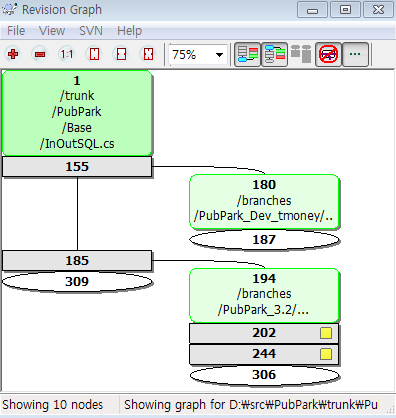

# clearcase 쓰던 습성으로 Subversion 적응

sw 개발하는 회사에서 소스 버전관리툴도 사용을 안한다면?

안좋겠지..

20명이 채 안되는 소회사에 적당한 버전관리툴은 뭘까?

경험해본 버전관리툴이래야 clearcase가 전부였다.

clearcase 사용하기전에는 그냥 날짜별 백업이 전부였다.

버전관리툴을 사용안하면 어떤 점이 안좋을까?

뭔가를 고쳤는데, 그로인해 side effect가 발생했다.

뭘 고쳤다고 side effect 가 바로 나타나는게 아니라고 한참 있다가 발견되니, 그 버그는 뭣때문에 생겼는지 찾는게 힘들다.

그러다보니 그냥 예전에 뭘 고쳤는지를 찾기 보다는 그냥 디버깅을 하고 만다.

코드를 수정하다면, 예전에 뭔가 고쳤는데, 대체 뭣 때문에 코드를 고쳤는지 기억이 나질 않는다.

/\\* 과 \*/로 주석처리하고 copy & paste 한 다음 만지작만지작 한다.

그러다보면 코드에는 주석이 한 바가지.

clearcase를 쓰면서, 와 이런게 있었구나하는 신천지를 경험했다.

버전관리툴 대해서는 많이 들었어도, 듣는 것과 아는 것이 천지차이고, 아는 것과 실제 하는 것 또한 천지차이이다.

그 비싼 clearcase를 사용할 돈도 없을 뿐더러, 그 복잡한 clearcase를 관리할 엄두조차 나지 않았다.

단일플랫폼 코드가 아니라서 종류가 좀 되었다.

한 제품에 웹+DB+PC+PDA 가 한 세트로 들어가고 있다.

웹은  html+ajax에 asp, db는 stored procedure, pc는 .net 기반 c#, pda는 .netcf기반 c#.

뭔가 기능 추가를 하거나 버그를 수정해도 한꺼번에 다 같이 수정할 일이 많다.

릴리즈 한번 하고 나면, 뭔놈의 사이드 이펙트는 그리도 많이 발생하는지..

역시나 버전관리툴없이 하고 나면 나중에 그 시점에 다른 것들도 같이 수정되었나 하면 가물가물한 기억을 더듬어봐야 한다.

subversion을 쓰기로 했다.

가장 널리 쓰는 오픈소스이니 뭔가 문제가 있거나 기능을 모를때로 정보 찾기가 쉬우니까..

서버툴로는 VisualSVN, 클라이언트 툴로는 TortoiseSVN

툴 자체 사용법은 매뉴얼이 많이 있으니, 알겠는데, 실제 업무 프로세스는 감이 안와, 이건 특별히 정성두씨 회사에 찾아가 하루 배우고 왔다.

위키때와는 달리 subversion에 대한 저항은 만만치 않았다.

가장 큰 장애는 최고의사결정권자 즉 사장님의 저항이었다.

사장님이 직접 코딩까지 하고 있는데, 예전 호랑이 담배피던 시절에 visual studio에 들어있는 소스세이프로 코드를 홀라당 날린 경험이 있던 터라, 버전관리툴에 강한 불신감을 가지고 있었다.

일단 사장님 빼고 진행하는 수밖에..

clearcase에 익숙한 나에게 subversion은 그 개념이 만만치 않았다.

clearcase의 이 기능과 개념은 subversion에서는 어떤지 그 감 익히는데 적지 않은 시간이 걸렸다.

branch와 revision의 개념이 clearcase와 달랐다.

clearcase에서는 config spec을 통해, 어느 브랜치를 깔고 작업하지, 어떤 버전을 바라볼지 제어가 되는데, subversion은 그게 안되었다.

trunk라고 하여 main 줄기 하나로 가는 거였다.

따라서 release label을 붙이는 것도 개념이 달랐다.  tag라고 하여 특정 revision을 tag 번호 붙이는 방식이었다.

clearcase의 방식이 좀 더 전문적이기는 했으나, 이는 전문적인 관리자가 필요한 시스템이다.

예전 회사도 clearcase관리하는 manager가 따로 있었으니..

subversion은 상당히 단순했다.  사용하다보니 왜 subversion은 브랜치를 따라 안가져가고 tag와 동일한 개념으로 가는지 이해가 갔다.  build manager없이 관리가 가능하도록 하기 위해 그러지 않았을까 싶다.

subversion으로 버전관리를 하다보니, 발생한 문제점.

버그수정과, 기능추가를 다 trunk에 하다보니, side effect가 발생했을 때 대체 어느 revision이 안정버전인지 확신할 수 없었다.

tortoise로 본 revision graph.  clearcase의 version history view보다는 좀 직관성이 떨어지긴 하다.

그래서 개발버전, 안정버전 이렇게 가져가기로 했다.

신버전을 release를 하고 나면 그 버전으로 tag도 만들고, branch도 만들어, branch에서는 버그 수정만 하도록 하였다.  버그 수정후에는 trunk로 merge하도록 했다.     더 나은 방법이 분명 있을 것 같긴 한데..

좀 일이 번거러워지기는 했으니, 이제 이것만은 안정적이다라는 안심을 한다.

subversion 도입 6개월째, 매주 코드인스펙션을 통해 슬슬 관심을 갖던 보스도 동참하여 드디어 사내 정착 성공.

subversion 쓰면서, 아직까지도 감탄하고 있다.  오픈소스라고 결코 허술하지 않다.

한가지 아직까지 아쉬운 점은 브랜치단위 릴리즈개념이 아니라서, 릴리즈 후 특정  리비젼에 문제 있어 그걸 제거했으면 할 때 어떻게 하면 되는지 잘 모르겠다.  clearcase는 그냥 config spec에서 그 branch 빼면 되는데,..  이것도 아직 잘 몰라서 그런거겠지..

