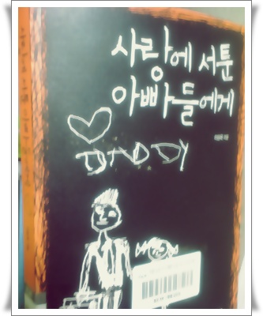

# 책 '사랑에 서투른 아빠들'을 읽고 딸과 사이좋게 지내는 방법을 생각

요즘 인기있는 케이블 방송중 롤러코스트 결혼편을 보다 인상깊은 장면을 봤다.

여자편이었는데, 결혼식을 하루 앞둔 여자방으로 아버지가 들어와 내일 행진하는것 미리 연습하자고 하여, 손을 잡고 걷는 연습하는거였다.

그 때 성우의 나레이션은 "아빠 손을 잡아 본게 10살 때 이후로 처음이예요...." 이런 말이었다.

롤러코스트가 대부분 사람들에게 맞다하며 공감을 자아낸다는 평이 있으니, 대부분의 아빠들이 딸과 손을 잡을 수 있는 시기는 10살때까지 다인가 보다.

내 딸이 지금 다섯살이니, 앞으로 5년이 손을 잡을 수 있는 기간인 셈이네.

결혼하고, 애 낳기로 결정하기까지  애 낳는 것에 것에 대해 꽤 심한 거부감을 가지고 있었다.

13년전 돌아가신 내 아버지처럼 되고 싶지 않아서였다.

내 기억속의 아버지는 돈벌어오는 기계인 불쌍한 존재였다.

식구들과 떨어져 있는 시기가 길다보니, 같이 집에 있어도 오히려 더 불편했었다.

가끔 집에 계실때의 아버지 모습은 자식들과 어울리지 못하고, 그냥 안방에서 책을 보는 모습이 대부분이었던 것 같다.

20대부터 돌아가신 할아버지를 대신하여 8남매를 키우는 가장의 무게가 장난아니었음을 그 시절 나도 심정적으로는 공감이 갔으나, 사춘기시절 떨어져 지내다보니, 서로 대화하는 방법을 잃어버렸다고나 할까나...

사서들이 권하는 추천도서라는 도서관 발행잡지에 "사랑에 서툰 아빠들에게"라는 책이 소개되었다.

추천사는

**홀로서기를 꿈꾸는 딸에게 아버지의 사랑을 전하는 17가지 방법.**

**'어릴 땐 잘도 품에 안기더니만, 어느새 저렇게 커서...'. 자신의 철옹성인 양 방문을 걸어 잠그는 딸을 보면서 아버지는 만감이 교차한다.  아무리 살갑던 부녀관계도 딸이 10대가 되면 싸늘한 냉각기에 빠져든다.  한번도 자신의 사랑을 오롯이 표현하는 학습을 받아본 적이 없는 아버지들은 어쩔 수 없이 무뚝뚝하고 권위적인 아버지가 되고 만다.  이 책은 이처럼 사랑을 표현하는 데 서툰 아버지들에게, 일상에서 자신의 가슴을 열어 보이는 방법을 알려준다.  저자는 아버가 딸에게, 또는 딸과 함께 해 봤을으면 하는 것들을 하나씩 풀어놓았다.**

저자는 딸이 중1 여름방학때부터 중3겨울방학때까지 이 3년이 부모를 무조건 거부하고, 독립성을 찾으려는 시기라고 하였다.

그래서 이 시기 각별히 관계가 소원해지지 않도록 신경써야 한단다.

딸에게 어떤 아버지로 기억되길 원하는가?

적어도 사이좋은 부녀지간이었다라고 말할 수 있게끔 노력해야겠다.

어떻게?

공유하는 시간을 많이 가지도록 해야겠다.

같이 도서관가기, 같이 스케이트타기, 같이 보드타기, 같이 윈드서핑타기, 같이 피아노배우기, 같이 개그콘서트보기, 같이 쇼음악중심보기,..  할 것은 많군..

딸이 중학교에서 들어갈 때쯤,  그 때 다시 한 번 이 책을 읽어봐야겠다.

