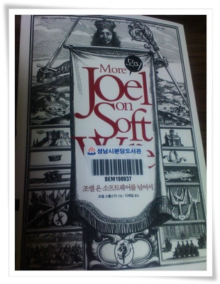

# 책-조엘 온 소프트웨어를 넘어서

컴퓨터 서적인데, 순전히 글자밖에 없는 책이다.

수필집같은 느낌인데, 꽤 재미있었다.  공감가는 내용이 많아서인 듯 하다.

저자 조엘은 마이크로소프트에서 첫 직장생활을 한 사람인데, 거기에서의 경험담 중 빌게이츠에 대한 내용은 신선한 충격이었다.

이제까지 빌게이츠에 대한 생각은 물론 천재이기는 하지만, 그냥 사업을 잘하는 사람이란 생각이 많았다.

_빌은 전날 작성한 500페이지의 명세서를 몽땅 다 앍고 매 쪽마다 여백에 뭔가 써 놓았다._

_상사가 말하길 "빌은 네가 만든 명세서를 검토하려고 했던 게 아니야, 빌은 자신이 모든 상황을 지배한다는 사실을 네게 각인시키고 싶었을 뿐이었지."_

_빌은 가변형 com 객체와 IDispatch를 이해하고, 오토메이션과 가상테이블차의 차이도 알고, 이 때문에 dual interface가 생겼다는 사실도 안다._

그리고, 이제껏 MBA에 관한 신화를 " _펩시를 잘 팔았으니 컴퓨터 회사도 잘 운영하리라는 근거 없는 믿음을 가진 이사회가 CEO에 앉혀 놓았더니 애플을 거의 말아먹을 뻔했던 존 스컬리"_ 라고 쓰며 비판.

그리고 80년대 스프레드쉬트로 유명했던 로터스가 망한 배경으로 설명된 잘못된 예측과 판단.

_80286이 막 출시된 시절 로터스는 한달에 10,000달러짜리에 돌려야하는 프로그램이라면 시장성이 없다고 판단하여 640Kb에서 돌아가는 3차원스프레드시트를 18개월동안 개발했다가, 보니 이미 시장은 80386이 나와서 망했다._

_헌데 MS와 애플은 무어의 법칙을 믿고 뭔한 쿨한 제품을 일단 만든 다음 하드웨어 성능이 뒷받침해줄 때까지 기다리기로 결정했다._

그중 프로그래머에 하는 당부하는 말로  **_SI와 제품개발이 80:20 으로 존재하기는 하나, SI를 하지는 말아라.  영혼을 좀먹는 짓이다  라는게 놀랍더군.  우리나라와 미국의 차이가 있기는 하지만, 미국의 문화가 부럽기는 하더군._**

