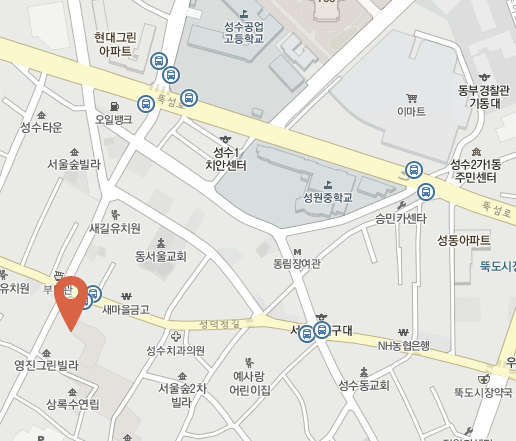
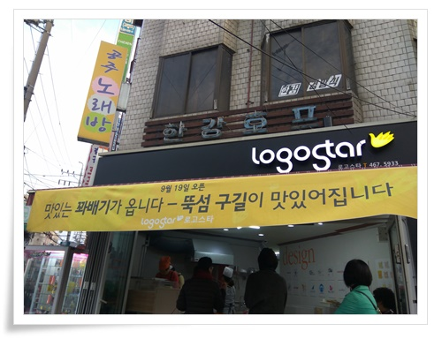
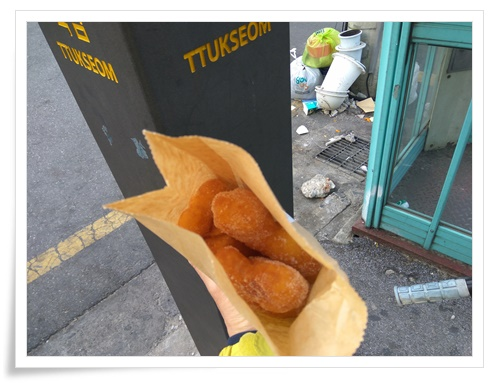
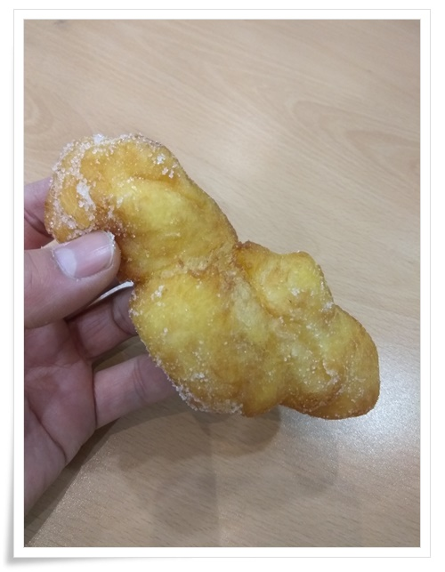

# 성수동 꽈배기 전문점

성수동으로 활동 무대를 옮기면서 역시나 동네 탐험을 열심히 하고 있다.

점심 식사 후에는 한강을 찍고 오는 코스로 산책을 하고 있다.

한달 전 쯤 왠 꽈배기 파는 곳이 생겼다.

아무리 근래 성수동이 핫한 플레이스로 인기를 끌고 있다고 해도 왠 쌩뚱맞은 꽈배기집인가 싶었다.

그다지 유동인구가 많아 보이지는 곳에다 말이다.

\- 저기가 꽈배기 집 위치.

근데 내가 꽈배기를 좋아한다.

싸구려 입맛이라서 꽈배기, 찹쌀도너츠가 내가 좋아하는 튀김 간식이다.

꽤배기라면 식어빠진 거라도 좋아한다.

\- 상호가 전혀 꽈배기와 어울리지 않아 보인다.

파는 것은 꽈배기, 오뎅, 떡볶기.

그런데, 생각보다 여기까지 와서 꽈배기 사는 사람이 제법 많다.

꽈배기 1개 500원.

\- 2천원어치 4개 샀다.

\- 이렇게 생겼다.

그리고 맛있다.

이제까지 먹어본 꽈배기 중에는 최고라 할 만 하다.

과연 꽈배기 하나만 가지고 장사할 만 하다.

