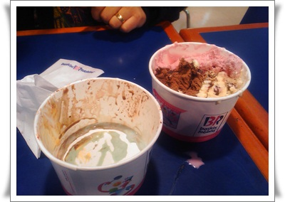

# 아직도 아이스크림에 심취한 철없는 어른들

친구 세명이 모였다.

대학 친구들.  승주, 수열

다들 담배를 안피고, 그리고 다들 비만1단계들이다.

간만에 만나서 한 일.

독산동 우시장에서 소고기 3인분.

먹는데만 주력하여, 저녁 7시반부터 8시 반까지 앉아 있었다.

젓가락 움직이는 거 외에 별다른 대화는 없었다.

오로지 먹는데 집중했다.

남들처럼 2차를 호프같은 곳으로 가지 않는다.

2차는 베스킨라빈스로..

근처에 있는게 독산동 홈플러스내에 있는 베스킨라빈스.

아이크림하나 먹자고 철없는 어른 세명이 거기까지 걸어갔다.

그리고, 파인트에 종류 세가지를 시켰다.

맛있게 먹었다.

그리나서, 다들 눈치 보기.

파인트 한통으로는 아쉽다는 눈치.

또다시 파인트한통 시켰다.

점원이 물어본다.

"포장이시죠?"

애도 아니고, 30대중반을 넘은 비만1단계들이 설마 그 자리에서 아이스크림 한통을 먹어놓고, 설마 추가로 먹는 어처구니 없는 자들은 아니겠지라는 뜻이겠지.

"아뇨, 먹고 갈꺼예요"

"아, 그래요.." 점원 얼굴에 스치는 미소 한줄기.

이렇게 세명이서, 아이스크림 두통을 그 자리에서 먹어치웠다.

1차 고기, 2차 아이스크림을 다 하는데, 걸린 시간은 두시간.

7시에 반나 9시에 1,2차를 모두 종료하고 바이바이를 하고, 헤어졌다.

