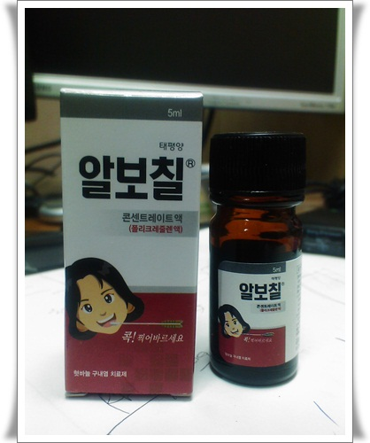

# 지옥의 명약 알보칠

입안이 헐었다.

하루이틀 갈 줄 알았는데, 일주일 넘게 가더군.

지난주 밤샘야근하고, 심야보딩하고, 장시간 운전하는 통에 피로가 쌓였나 보다.

음식먹을 때마다 아파, 결국 약을 쓰기로 했다.

입안에 헐때 쓰는 약은 많은 광고가 나오는 오라메디밖에 떠오르는 게 없었다.

헌데, 예전에 써본 소감으로는 크게 잘 들은 것 같지는 않았다.

그래서 구글에 검색을 해 봤다.

입안 헌 곳에는 **알보칠** 이 진리라는군.

그래서 알보칠을 샀다.

약국에서 5천원주고 산 알보칠.

포장에서부터 카리스마가 막 풍겨나온다.

[백괴사전](http://uncyclopedia.kr/wiki/%EC%95%8C%EB%B3%B4%EC%B9%A0) 에도 설명이 되어 있다.

그것보다는 구글 검색을 해보니 [사용기를 모아 놓은 것](http://jwmx.tistory.com/433) 도 있더군.

한번 바르면 지옥을 경험하게 된다는군.

과연 어느정도 이길래라면 용법대로 면봉에 붙여 직접 입천장에 찍었다.

그런데, 안 아프더군.  잘못 찍었나 생각하고, 아내에게 발라달라고 하여 입을 크게 벌렸다.

역시 소문대로의 알보칠이더군.

고통이 어금니 신경을 거쳐 귀를 거쳐 뇌로 전달되면서 엄청난 편두통이 찾아오더군.

아내는 약을 더 발라줄까라고 물어보는데, 난 그냥 손을 젓기만 했다.

그래도 한번 발라보고 나서 두번째부터는 할만했다.

이것도 나름 중독성 있는 통증인 듯 싶다.

시원함이 함께 섞여있는 통증이라고나 할까..

효과는 좋다.  한번 발랐는데, 입안 헌 곳이 많이 치료된 듯한 느낌이다.

