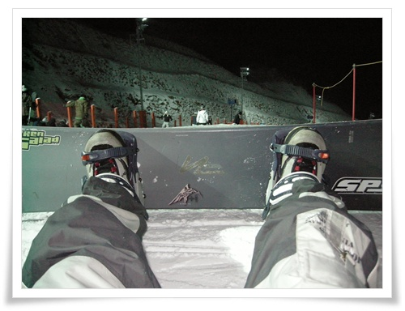

# 이제 심야스키장은 무리인 나이가 됐다

회사 사람들과 같이 간 스키장.

이번 시즌 첫 보딩이었다.

목적지는 곤지암리조트

회사에서 6시 땡하자마자 출발했다.

하지만 곤지암근처 식당에 도착한 시각은 9시.

가산동에서 3시간걸려 간 것이다.

억울한 점은 가산동 벗어나는데만, 1시간 걸렸다는 것이다.

아파트형공장은 잔뜩 지어대면서 도로는 전혀 정비 안하는 금천구청에 완전 실망이다.

저녁먹고, 여직원들이 좀 많다보니, 렌탈샆에서 빌리는데만 1시간 소요.

그리고 나서 스키장으로 향했는데, 리조트입구에서 주차장에 주차장 1km 가는데 40분소요.

그래서 새벽 1시부터 보딩을 시작했다.

마지막으로 심야보딩은 한 때가 3년전이다.

그 때도, 타고 나서 그 다음에 완전 넉다운되었었는데,.. 이번엔 무사할려나 했다.

2001년에 299,000원주고 산 보드세트.

이제 슬슬 수명이 다 되는 것 같다.

새벽 1시부터 끝나는 새벽 4시 반까지 탔다.

그리고 나서, 6시 아침해뜨기전 서둘러 자기 시작하여 11시에 일어났다.

곤지암리조트는 차가지고 갈 데는 못 되겠더군.

곤지암에서 빠져나가는 3거리까지 5km 정도 거리를 또 한시간에 걸쳐 기어 갔다.

서른중후반 나이에 심야보딩은 이제 무리라는 확실히 인지했다.

