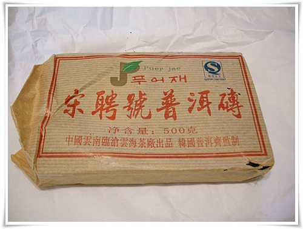
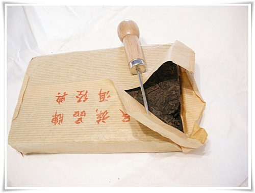

# 은근한 흙냄새가 좋은 보이차

이번에 동생이 준 보이차

부실한 내장기관탓에 커피나 녹차차를 마시고 나면 속이 쓰리고 한데, 보이차는 그렇지도 않고, 오히려 속이 따뜻해지는 것 내 체질에 맞는 듯 하다.

보이차 처음 마신게 2년전.

발효차다 보니, 그 이질적인 맛과 향에 적응이 안되더군.

몇번 마셔보니, 그 약간 썪은 듯한 흙냄새가 그리 좋을 수가 없다.

