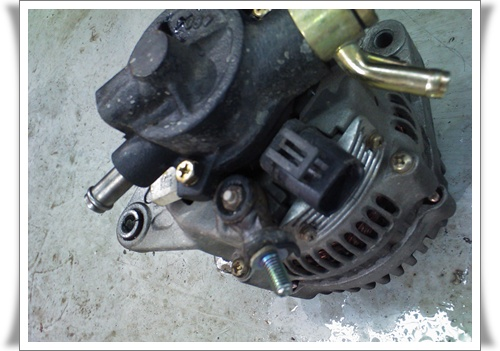
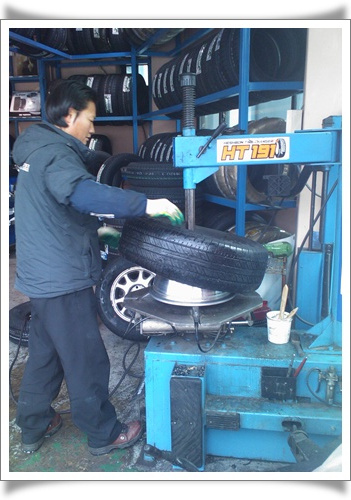

# 분당의 믿을 만한 카센터 찾기, 10년정비센터

[새해 첫날을 긴급출동서비스만 두번 부르고](../10372444.html) 나서, 다음 날 차를 고치러 갔다.

내가 카센터를 잘 믿지 못한다.

워낙 허술한 곳이 많다.

록스타때, 엔진헤드만 세번 교체했는데, 장안평의 카센터는 록스타가 차가 안좋아서 그렇다며, 그냥 헤드만 주구장창 교환하자고 했었다.

결국 충추의 국민카공업사라는 명인이 원인을 잡아 해결해줬다.

원인은 라디에이터캡 불량으로, 냉각수가 보조통으로 나가기만 하고, 들어오지 않았기 때문이었다.  5천원짜리 부품이 문제였는데, 원인은 안 찾고 말이다.

갤로퍼때, 나름 갤로퍼 동호회에서 강추하는 카센터였는데, 타이밍벨트 교체하면서, 엔진오일 줄줄 세게 만들고, 한다는 말이 차가 오래되서 그렇다는...  그리고 가끔 시동 모터가 안 돌때가 있는데, 그에 대한 진단이 시동모터가 맛이 가기 시작하기 때문이라면서, 이러다가 아예 동작안하니 교체해야 된다는 거였다.  원인이 없으니 뭐 납득도 할 수 없는 거였다.  그래서 시동모터의 구조와 고장원인에 대해 찾아봤다.  원인은 시동모터에 브러쉬라는 부품이 들어가는데, 그게 오래되면 카본 찌꺼기가 끼어 접점이 불량해진다는 것.  수리방법은 분해해숴 카본 찌꺼기를 제거해주면 되는 것인데, 보통 카센터에서는 부품 통째로 갈려고 하지 찌꺼기 제거는 할 생각도 안하는 듯 하다.

그래서, 어지간하면 카센터는 엔진오일 교체할 때나 이용하고, 그외는 혼자서 정비를 한다.

그래서 집에 사둔 자동차 정비 공구도 꽤 된다.

이번 연초 시동안걸린 문제도, 긴급출동한 아저씨왈 배터리도 수명 다됐고, 스타트모터도 수명 다됐다는 말.

기계 수명은 무슨 계측하지도 않고 바로 알 수 있는 것인가...

배터리 한번 방전되면, 무조건 배터리를 교체해야 한다고들 하는데, 배터리 만드는 엔지니어들이 그렇게 허술하게 만들지는 않는다.

그리고, 내가 배터리 완전 방전을 서너번씩은 당해 봤는데, 별 문제없이 타고 다녔다.  물론 성능저하가 조금 되기는 하지만, 말처럼 못쓰게 되지는 않는다.

암튼, 카센터를 이용않던 내게 알터네이터 교환을 해야 하는 문제가 생겼다.

이것은 카센터에 맡겨야 하는데, 대체 어느 카센터에 맡겨야 하나 고민이었다.

인터넷 서핑을 통해 찾은 곳이 [자동차시민연합](http://carten.or.kr/) 에서 하는 [10년타기정비센터](http://www.car1023.com/) 라는 곳이었다.

일단 비영리기관에서 감시가 되는 곳이니 아예 사용자평을 찾을 수 없는 곳보다야 믿을 수 있겠다 싶었다.

집 근처에서 가장 가까운 10년정비센터가 정자동에 있는 포드A형리무진 이라는 카센터였다.

눈 내리는 토요일, 갔다.

이곳이 내가 간 곳.

증상을 말해주고, 원인이 알터네이터같다고 하니, 테스트기로 전압 13.2V나온 것 확인후, 교체해야 한다고 했다.

가격은 재생 알터네이터로 해서 18만원.

카니발이 다른 차보다 알터네이터 교체 작업이 어려워, 2시간은 넘게 걸린다고 하더군.

부품값 얼마, 공임비 얼마 이렇게 답해줄 거라 기대했는데, 조금 실망스럽긴 했다.

재생알테너이터 가격이 10만원정도고, 시간당 공임료 3만원으로 계산해봤을 때, 뭐 썩 비싸지 않은 가격이라 생각하여 교체해달라고 했다.

탈거된 알터네이터.

문제는 안터네이터 단자의 헐거움이라고 한다.

이것도 바로 알터네이터 재생집으로 들어가면 단자 교체후, 다시 재생으로 판매되겠지..

알터네이터 교체하고 나니, 전압은 13.9V로 정상전압이 나왔다.

룰루랄라하며 집으로 와, 차를 주차하는데, 공기 새는 소리가 들렸다.

전날 교체했던 스페어타이어가 펑크난 타이어였더군.

또다시 카센터로 이동.

카센터 정비사 지렁이 하나 박았는데, 그래도 바람이 샌다.

타이어를 교체하는 수밖에 없단다.

그래서, 타이어를 교체하러 갔다.  집근처의  타이어가 신발보다 싸다고 선전하는 곳으로 갈려고 했는데, 평상시 그렇게 많은 보이던 타이어 할인 가게가 이날 따라 왜 그렇게 안 보이더지.

그냥 무작정 가다보니 용인시 수지구 풍덕천동.  그 곳에 타이어테크가 있었다.

그곳에서 넥센 215/70/R15 타이어 가격을 물어보니 개당 80,000원.

오호  이정도면 코스트코보다도 싼 가격인데.. 하면 두개 갈아달라고 했다.

스페어타이어와 앞우측타이어 이렇게 두개가 펑크여서, 멀쩡한 좌측 타이어를 스페어로 돌려달라고 했다.

스페어타이어를 빼는데, 이런 제길...

스페이어타이어 거치하는 볼트가 헛돈다고 한다.

전날 긴급출동아저씨가 임펙트렌치로 세게 조이더니, 나사선이 닳았나보다.

어쩌겠는가, 일단 타이어만 교체했다.

풍덕천동의 타이테크에서 타이어 교체중.  이곳도 제법 친절하다.

스페이어거치대 수리를 위해, 타이어를 그냥 트렁크에 싣고 다시 카센터로 이동.

다시 포드카센터에서 스페어타이어거치볼트 교체중.  수리비는 15,000원.

작업하시는 정비사분.  꽤 친절하다.

이렇게 새해초 액땜은 끝났다.

