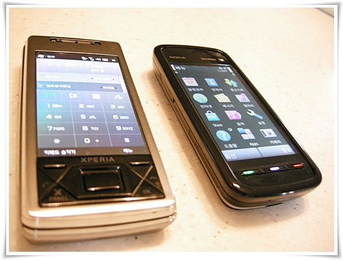

# 엑스페리아와 5800 익스프레스뮤직 사용 소감

아이폰덕에 스마트폰이 많이 싸졌다.

그 덕에 공짜로 스마트폰으로 갈아탈 수 있게 됐다.

애플 아이폰이 소위 말하는 간지 나보이기는 하지만, 난 윈도우모바일이 더 끌리더군.

간만에 핸드폰을 사다보니, 핸드폰 구매 용어부터 익혀야 했다.

뽐뿌게시판에서 주로 쓰이는 용어인데,

엑스페리아는 24/22, 가면,요자,부무,유휴  ( 24개월 약정, 위약금 22만원, 가입비면제, 요금제자유, 부가서비스없음, 유심후불 )

익스프레스뮤직은 24/14, 가유,요자,부유,유후 (24개월 약정, 위약금 14만원, 가입비있음, 요금제자유, 부가서비스있음, 유심후불)

이 조건으로 샀다.

엑스페리아는 내꺼, 익스프레스뮤직은 아내꺼.

위도우모바일은 결코 쉽지 않은 운영체제라 아내가 쓰기는 힘들거라 여겨 아내는 가난한 자의 아이폰이라 불리는 노키아의 심비안OS로 했다.

둘이 나란이 바꾼 핸드폰.

엑스페리아는 역시 쉽지 않은 폰이더군.

그래도 내가 명색이 전직 핸드폰 개발자이자, 현재 PDA 소프트웨어를 개발하고 있는데도, 기능 숙지를 아직 다 못했다.

그래서 장난감으로 재미가 아주 쏠쏠하다.

퇴근길 이것저것 만져보며, 이것은 이렇군 하며 기능 탐색하다보면 시간이 잘 간다.

현재 설치한 프로그램은 mp3 플레이어로 Nitrogen, 동영상플레이어로 tcpmp, 전화녹음으로 Audio Notes, 그리고 구글맵 등을 깔았다.  동기화는 outlook하고 하는 것이 아닌 구글메일과 구글칼렌다로 하게끔 설정하니, 어디서나 메일 확인, 연락처 동기화가 되더군.  물론 데이터요금을 방지하기 위해 3G 데이터통신기능은 막았고, WiFi로만 하고 있다.

그다음으로 배송온 익스프레스뮤직.

노키아의 연륜답게 편하게 잘 만들었더군.

기계치인 아내가 배송받아 직접 유심꽂아 전화 사용을 한 스마트폰이다.

4G짜리 microSD 카드도 처음부터 꽂아진 상태로 배송이 왔고, PC랑 Sync하는 프로그램도 아주 편하게 만들져있더군.

익스프레스뮤직에 설치한 프로그램은 일단 구글맵만 설치했고, mp3 음악들만 쭉 복사해놨다.

음질이 좋더군.

새 장난감이 생겼으니, 당분간 심심하지 않겠다.

