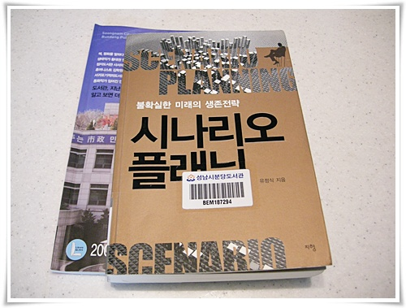

# 분당도서관 대출회원증 만들고 처음 빌린 책

근래 너무 책을 안읽었다.

도서관에 딸과 함께 가다보니, 내가 읽을 겨를이 없었다.

그래서 대출회원증을 만들었다.

도서대출회원증은 거의 20년에 만들어보는 듯 하다.

고등학생때 정독도서관과 동대문도서관에 대출회원증을 만들어 매주 책을 빌려 읽었다.

그때 그 도서관들은 대출가능 책은 별도로 있었고, 가짓수도 부족했다.

이곳 분당도서관은 그런 제약이 없더군.

준비사항은 사전에 인터넷으로 회원가입하고, 증명사진 가져가는 것.

근래 증명사진도 안찍었기에, 10년전 찍은 증명사진 가지고 갔다.

회원카드는 바로 발급해주는 것이 아니라, 좀 시간이 걸린다.

그래도 대출회원신청하면 바로 신분증으로 대출이 가능하다.

처음 빌린 책은 바로 시나리오플래닝.

사실 이 책을 빌릴려고 대출회원증을 만든셈이다.

불확실한 미래를 예측하는 것이 아닌, 무엇이 불확실한지를 추려내고, 그 불확실성에 따로 변동되는 것이 무엇인가에 따져 시나리를 만드는 방법론인데, 어렵다.

그냥 문장문장은 이해되도, 읽고난후, 서로 연결이 잘 안되는군.

사회학 공부를 좀 해야겠다.

