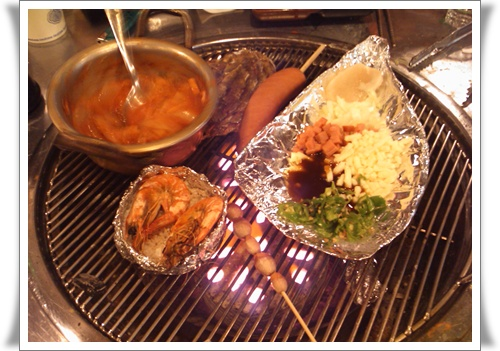

# 강남맛집 갯벌의 진주

경률씨와 함께 간 강남 영동시장에 있는 조개구이집으로 갔다.

조개구이라고 해서, 너무 늙은 메뉴 아닌가 했다.

조개구이하면 떠오는 것이 예전 IMF때 1년 반짝했던 아이템이라는 생각이 거의 전부니..

그리고, 대부도 같은 곳에 갈때는 먹는 음식.

몹시도 추운 날, 이 조개구이를 먹으로 갔다.

강남 교보타워 사거리 근처에 있는 영동시장에 있었다.

영동시장. 이곳은 평소 와 보지 않던 곳이라 그런가, 이런 곳이 있던가 싶게 활기차더군.

조개구이집인데, 30분 기다렸다.  이것도 날이 추워 사람이 없어서라는 거였다.

처음 나온 조개.

다음 불판으로..

조개 이름들은 잘 모르겠다.  가리비는 있는 것 같은데..

그리고, 마지막은 새우와 쥐포, 소세시, 키조개.

뭐 물론 중간 생략된 조개들이 있다.

맛있더군.

예전, 대부도에 가서 먹었던 조개보다도 훨씬 맛있었다.

둘이서 먹었는데도, 조개만으로 배가 부르더군.

이게 외관.

좀 허접해보이는 게 컨셉인가 보다.

일하는 사람 모두 군복에 깔깔이를 입고, 활기차게 일하는 모습에 젊은 아낙들도 많이 오는 요인인가 보다.

