# 딸래미와 함께 바다 낚시

[지난번 광어를 잡은 것](../10240200.html) 에 삘을 받아 거의 연중행사인 낚시를 또 갔다.

이번엔 식구까지 대동하고 나섰다.

겨울이 되면 동면준비하느라, 야행성을 바뀐 아내와 딸래미는 밤에 안자고 바로 새벽 두시에 집을 나섰다.

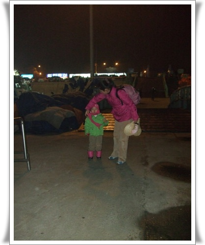

인천 남동부두에서 배를 타러 가고 있다.

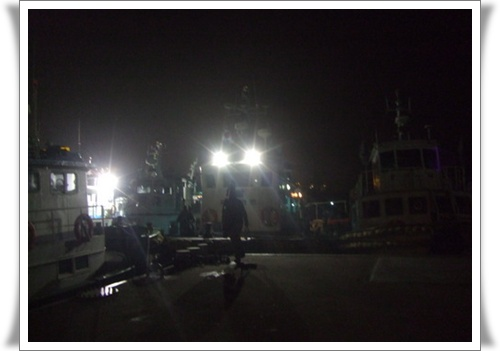

새벽 4시반.  저 앞 쌍라이트를 켠 배가 우리가 타는 자이언트호

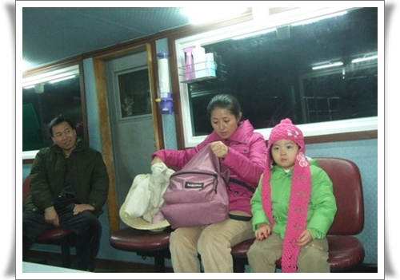

배에 승선하여 라면을 기다리는 민이사님, 아내, 그리고 딸래미.

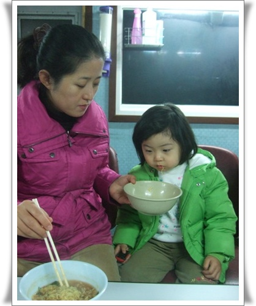

비몽사몽간에도 라면을 먹고 있는 딸래미

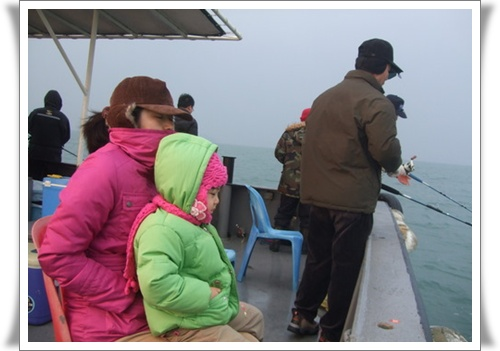

낚시는 아침 7시부터 시작.  아직 몸이 안풀린 상태로 있는 모녀.

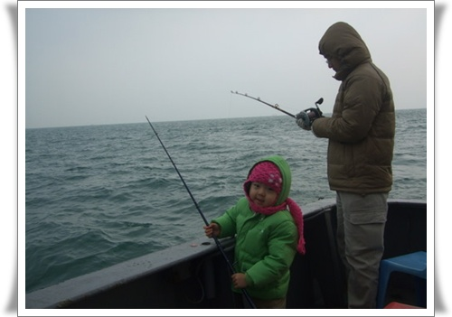

기운을 차린 딸래미.  자기도 낚시하겠다고 하여 그냥 낚시대에 추만 달아주었다.

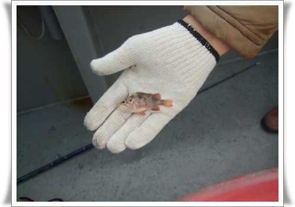

애기가 낚시한다고, 이렇게 조그만 치어가 잡히더군.  좀 더 커서 오라고 바다로 컴백.

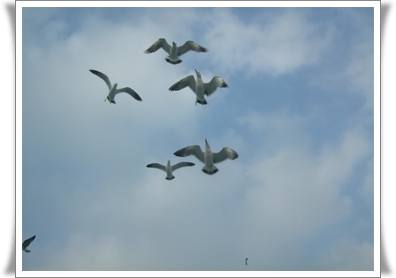

배가 움직이면 갈매기도 같이 움직인다.  따라다니면 먹을 거가 생기니까.

딸래미와 같이 잡은 물고기.  낚시줄을 딸과 같이 잡고 있었는데, 저 놀래미가 잡히더군.

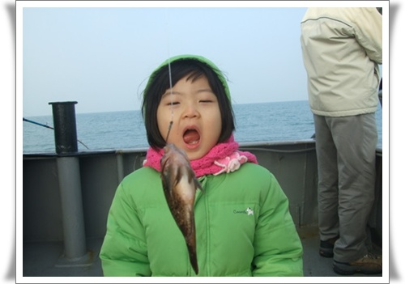

이어서 잡힌 우럭.  맛있게 먹어보라니까 저렇게 입을 벌린다.

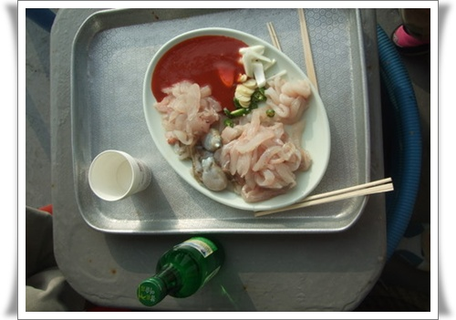

아침 10시에 먹은 회.  10시까지 잡은 우럭 5마리와 놀래미 한마리, 그리고 쭈꾸미 2마리다.

선상낚시의 재미는 오전에 먹는 회다.

10시까지 잡아서 회로 먹어야 한다.

배가 고픈상태라 가장 맛이 있다.

이때 못 먹으면, 11시 점심때까지 회를 뜰수가 없다.

그리고 점심후에 먹는 회는 아무래도 아침에 먹는 것보다 못하다.  이미 배가 부른 상태니까..

이 맛을 한번 못 보면, 일반 횟집에서 회 먹기 힘들다.

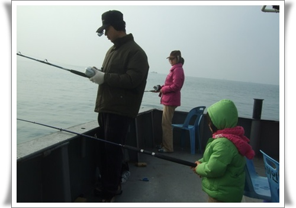

딸래미는 꿋꿋하게 바늘없이 추만 달리 낚시대로 고기 잡겠다고 한다.

그러면서 고기가 자기한테만 안 온다고 말한다.

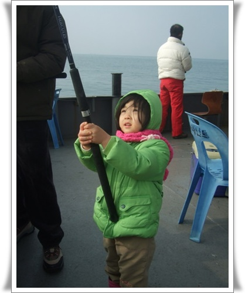

추만 달랑 달렸는데도, 수시로 올려 물고기가 있나 확인까지 하면서...

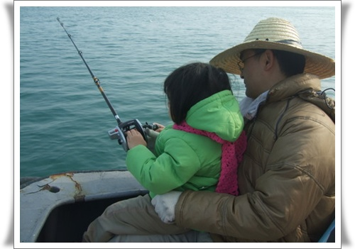

오후가 되니, 자기가 쓰는 낚시대가 다른 사람들것과 다른 것을 눈치챘다.

자기도 릴이 있는 낚시대로 하겠다고 하여, 내 껄로 낚시한다.

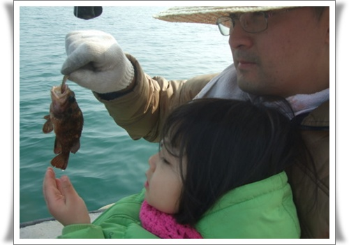

그래서 결국 잡은 물고기.  뽈락.  역시 너무 작아 바다로 다시 풀어줬다.

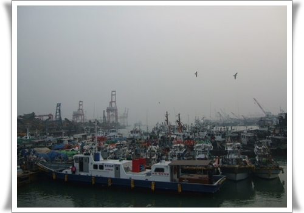

오후 5시.  낚시를 마치고 다시 부두로 복귀

이걸로 올해 나의 낚시시즌 종료.

내년 5월경 다시 시작한다.

