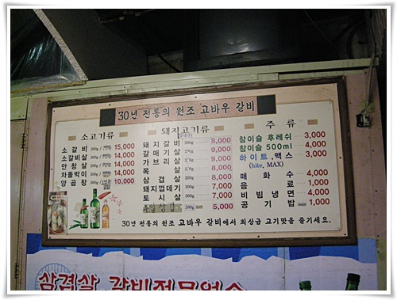
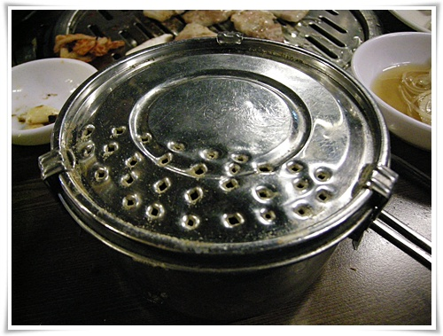

# 신림동 맛집 고바우 돼지갈비

친구를 신림에서 보기로 했다.

친구의 서식처는 강남과 부천.  나는 가산동과 분당

가산동으로 교통과 맛집에 너무 열악한터라, 중간지점인 신림.

신림은 내 생활권이 아니라 맛집이 어딘지 모른다.

신림이라하면 순대타운밖에 모른다.

그래서 인터넷 검색.

광고로 도배되어 믿을 수 없는 국내 포탈의 검색은 믿을 수 없기에, 구글에서 "신림 맛집"으로 검색.

그 중 많이 검색되는 것이 고바우 돼지갈비더군.

검색 블로그 중 " [신림동 35년 전통 원조 돼지갈비, 고바우](http://xenix4u.egloos.com/2764754 "")" 글을 보고 고바우로 정한 후 칼퇴근.

신림역3번 출구에서 50미터 정도 거리에 있었다.

외관은 허름.  실내도 허름.

주력 메뉴는 돼지갈비.

맛 괜찮다. (도곡동 매봉역 근처에 있는 마포돼지갈비보다는 좀 못하긴 하지만, 그거 제외하고는 우수하다)

가격 아주 훌륭하다.  3명이서 돼지갈비 3인분을 먹었는데 배가 부르다.

서비스 아주 훌륭하다.  떨어진 반찬을 알아서 채워준다.  그리고 후식 물냉면을 그냥 준다.

고기집에서 처음 본 물건.  후추양념통이다.

스테인레스반찬통에 가득 채워놓은 배포가 크다.

