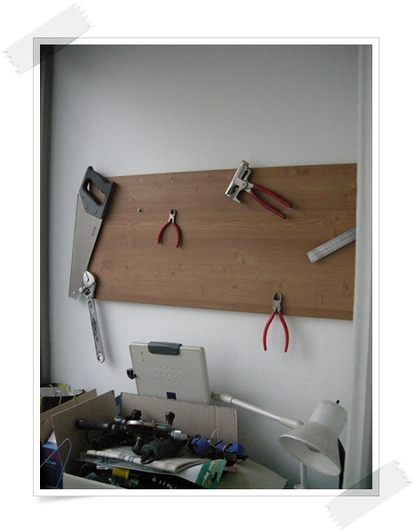

# 허접한 공구 거치대 만들기

목공을 하겠다고, 이것저것 공구들을 샀는데, 여기저기 두다보니 정리가 안되어, 정리하기로 했다.

벽에다 걸어두는게 좋을 것 같아, 쇼핑몰을 찾아봤는데, 마땅한 게 없어 그냥 만들기로 했다.

만든다기보다는 그냥 벽에다 걸어 둔 것 뿐 이군..

재료는 아파트 재활용 놓는 곳에 버려진 합판.

그 합판을 그냥 벽에다 박고 거기에 못을 밖아 그냥 공구들 걸었다.

웬지 폼이 안나는군.

나중 다시 업그레이드를 해 봐야겠다.

