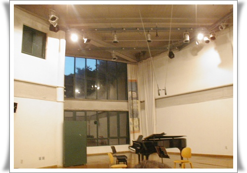
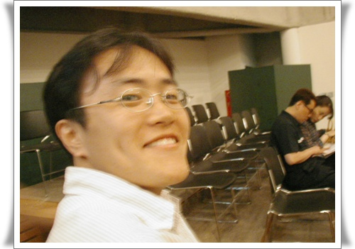

# 두물워크샵의 추억

[장한나첼로공연](../10263752.html) 을 보다 생각한 곳.  두물워크샵.

2002년에에 거의 매달 갔었던 것 같았다.

공연은 일요일 저녁 7시쯤에 있었다.

그래서 나가는 길도 안 막혔고, 서울로 돌아오는 길도 늦은 시각이라 막히지 않았다.

북한강변에 위치한 두물워크샵.

가장 마음에 든 점은 공연장소.

한 30여평정도되는 공간에 공연자와 관객이 있고, 관객과 연주자의 사이는 가까이는 2m, 멀게는 5m정도 밖에 안되는 지근거리다.

그래서 예술의전당과 같은 큰 콘서트홀에서 느낄수 없는 생생함이 있었다.

결혼전 아내와 같이 다니다가, 심상민과도 같이 세명이서 갔던 날이었나 보다.

예전과 같은 공연이 다시 한번 있었으면 좋겠다.

