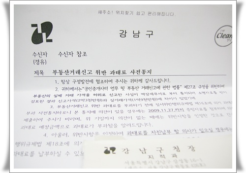

# 다시 떠오른 빌라의 안좋은 기억

며칠전 도착한 과태료.

조그만 빌라를 재건축하는데도 무슨 비리가 그리도 많던지..

첫번째 조합장은 튀고, 시공사는 도중에 돈 없다고 배째라 했고..

과태료의 내용은 실거래가신고 위반이란다.

내가 했으면 억울하지도 않지..

15세대 공동으로 매입했다가 분양한 세대가 있는데, 두번째 조합장이 지 아들에게 분양하면 실거래거와 다르게 신고했다(아니면 진짜 그 금액으로 했던지..)

나야 재건축 분담금만 내면 되었기에 그냥 공동분양한다는 것에 인감도장만 찍었더니, 이렇게 되었더군.

구청에 가서 사정을 설명하였지만, 선의의 피해자이기는 하지만 실정법위반은 맞기에 어쩔수가 없다더군.

경험해보며 왜 사람들이 빌라를 기피하는지 알게 된다

신혼집을 빌라에서 시작했었다.

아파트 전세와 빌라 구매 두가지를 가지고 고민하다가,  아무래도 전세보다는 내 집이 좋을 것 같아 빌라를 샀다.

최악의 선택을 한 것이었다.

빌라에서 살아보니 왜 사람들이 빌라를 기피하는지 뼈저리게 느꼈다.

그전에도 아파트에 비해 단점을 알고는 있었지만 그래도 실감은 하지 못했었다.

3년을 빌라에 살면서 체험했던 단점

1\. 이상한 이웃을 만날 경우 지옥을 경험

\- 옥상에서 밤 늦게 줄넘기 하는 아주 4가지 없던 여자

\- 옥상 잠가놓고 혼자만 쓰던 여자 등..

2\. 주차공간 부족으로 집앞에 주차했다가 불법주차 딱지도 끊고,

3\. 멀쩡히 주차했음에도 이중주차한 차 때문에 차를 못 빼는 경우도 있었고,

4\. [산지 일주일된 새 자전거를 그대로 도둑 맞](../6166910.html) 고,

5\. 집을 팔려고 해도 정말 오래 걸리더군.  집 구경도 안 오더군.

6\. 많은 관리비

\- 엘리베이터비 5만원에 공동전기요금 2만원, 무슨무슨 명목3만원해서 12만원정도 매달 냈었다.

     이거에 개발 난방비와 개발 전기요금이 들어가니 아파트에 비교하면 더 많이 드는 거지.

암튼, 지나간 일은 빨리 잊는 게 좋겠지.

그래서 과태료 90만원을 속은 쓰리지만 냉큼 냈다.

다행이 지금 사는 아파트의 편안함으로 만족해야지.

