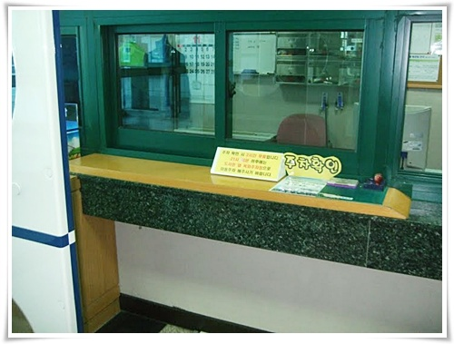
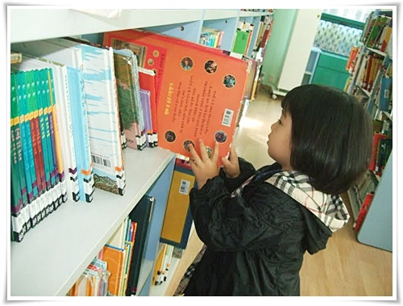

# 딸과 사이좋게 지내기

별 일없는 주말 아침이면 딸래미와 도서관에 간다.

애가 있기 전, 서울에 살 때는 주로 서초동에 있는 국립중앙도서관에 갔었다.

이제는 집 근처에 있는 시립도서관에 간다.

정자동에 있는 분당도서관하고 구미동에 있는 구미도서관.

구미도서관이 좀 더 새 건물이라 시설이 낫긴 하지만, 주차공간이 부족하여 주로 분당도서관으로 다닌다.

주차는 바로 맞은편에 있는 도서관부설주차장.

도서관 이용객은 두시간 무료주차다.

주차확인 도서장은 다른 도서관들과 마찬가지로 입구에 도장이 비치되어 있고, 알아서 찍으면 된다.

요즘 다른 도서관들의 추세는 어떤지 모르겠지만, 이 두 도서관모두 유아용 시설이 잘 되어 있다.

유아용 도서실은 신발을 벗고 들어가, 아랫목처럼 따뜻한 바닥에 앉아 책을 보면 된다.

딸래미는 이 책이 마음에 드나 보다.   한 참을 고르다 이 책을 집어 들었다.

물론 아직 글자는 못 읽기 때문에, 내가 읽어주고 있다.

도서관에서 제법 진지하게 책을 본다.

지금은 친하게 지내는 부녀지간.

그런데 언제까지 친하게 지낼 수 있을까 하는 생각이 가끔 든다.

회사 여직원이나 아는 여자분들에게 물어보면, 아버지와 사이 좋게 지내는 사례가 거의 없더군

그럼, 언제까지 아빠와 사이좋게 지냈냐고 물어보면 초등학교 2,3학년때까지라고 한다.

딱 사춘기 직전이군.

그럼 나라고 딱히 다를 것 같지는 않고, 친하게 지낼 수 있는 기간은 앞으로 5~6년 정도다.

나중 아빠와 공유하는 기억정도는 가질 수 있도록 해야겠지.

