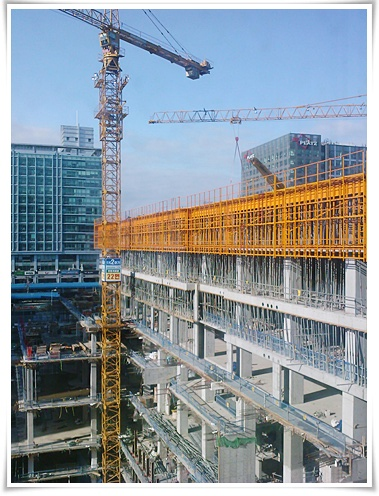

# 가산동 풍경

가산동으로 출근한지도 이제 1년반.

이제 적응할 때도 됐는데, 적응안되는 동네다.

원래 공장단지였던 동네가 디지털단지로 바뀌고 있는데, 왜 도로는 안넓히고 건물만 짓는지..

당췌 맛집은 왜 없는지..

사무실 창문으로 보이는 풍경.

또하나의 아파형공장이 세워지고 있다.

저거 다 지어지면 그나마 창문으로 보이던 하늘도 가리겠군.

녹지가 없다는 것이 가장 큰 불만이다.

식사후, 근처 공원같은 녹지대에서 10여분 산책하고 싶은데, 그런 공간이 없다.

금천구 청사는 비싸게 지으면서, 이런 도시 계획에는 신경도 안쓰나 보다.

하긴 내가 사는 성남시도 청사만 초호화판으로 지었지..

