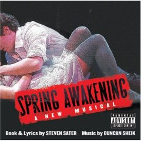

# 뮤지컬 스프링 어웨이크닝 (Spring Awakening)

간만에 뮤지컬 봤다.

오리지널팀의 CD나 DVD로 주로 보다보니, 우리나라에서 하는 뮤지컬을 아무래도 눈이 덜 가더군.

많이 발전은 하고 있다지만, 아무래도 금전적인 측면의 투자 규모가 다를테니 미흡할 것은 사실이었다.

제일 처음 본 뮤지컬은 90년 가을 교육문화회관에서 본 코러스라인.

그때는 뮤지컬자체를 처음 본 거라, 마냥 신기하고 재미었었다.

이번에 본 뮤지컬은 스프링어웨이크닝.

뮤지컬광인 동생이 같이 보자고 해서 보러 갔다.

별 기대는 안하고 갔다.

장소는 종로 5가에 있는 두산아트센터.

내용은 19세기 독일 청교도 마을을 배경으로 한 청소년의 고민.

썩 내가 좋아하는 내용은 아니다.

원래부터 청소년물을 안 좋아하는터라..

특이하게 무대안에도 관객석이 있었다.

그 관객석 사이사이 배우도 앉아 있다가 노래부르고 하는 것이 꽤 신선해보였다.

내 옆에서 뮤지컬배우가 노래를 부르고 있으면 꽤나 신기할 것 같더군.

막이 오르고, 청소년의 뻔한 주제로 흘러가기 시작해 하품을 하려는데, 음악이 날 깨우더군.

락 장르를 안 좋아하는데, 배우들을 노래를 너무 잘 부른다.

보통 공연들을 보면, 몇몇 눈에 띄면 몇명과 나머지는 그저 그런 배우들인데, 이 뮤지컬을 다들 괜찮았다.

노래하나가 머리속에 들어박혔다.

가장 놀란 점은 고등학생 관람가 뮤지컬인데도, 여주인공의 가슴이 노출되는 거였다.

하긴 문화수준이 많이 향상되었으니, 고등학생도 봐도 되겠지..

우리나라 뮤지컬도 참 많이 발전했다라는 생각이 들더군.

몇년전에 본 뮤지컬만 해도 보면서 손발이 오그라들곤 했는데,..

연기도, 노래도 빠지지 않는다.

